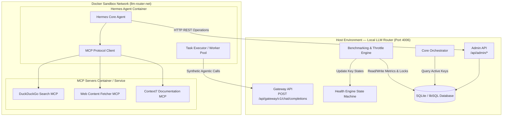
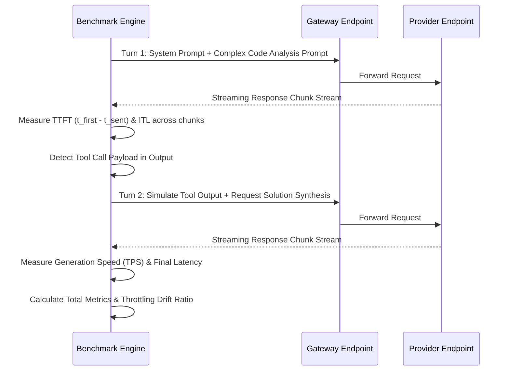
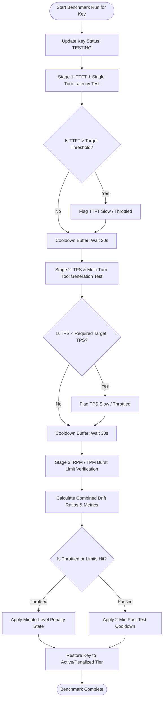
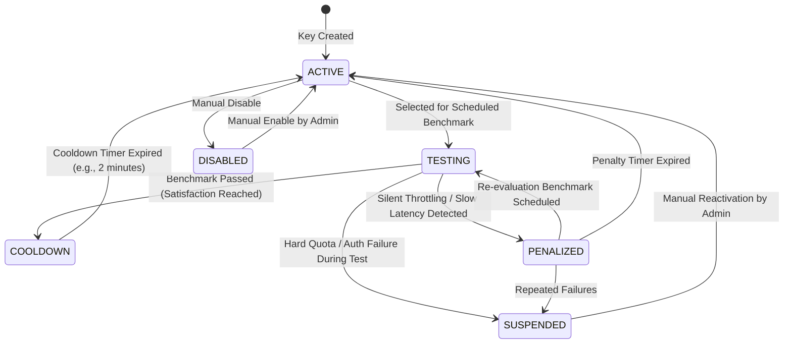
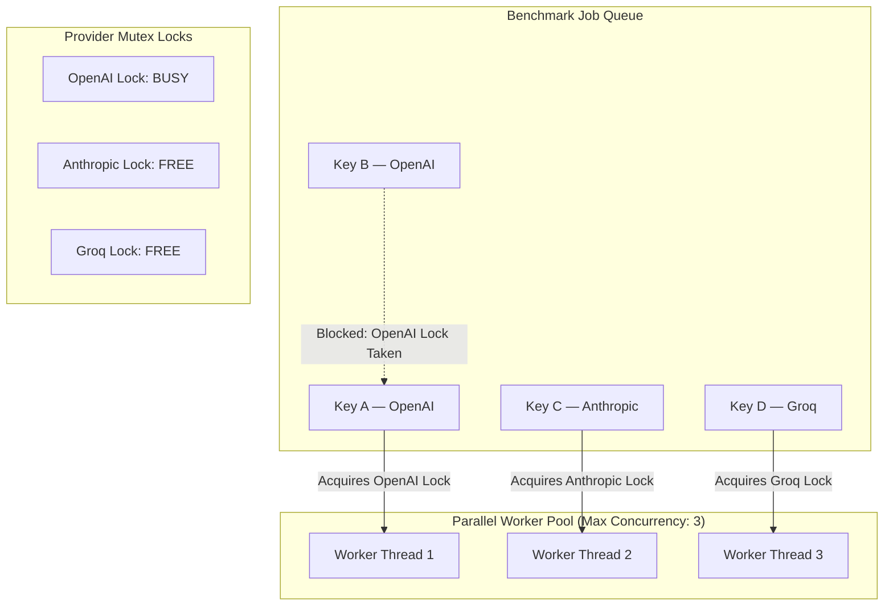
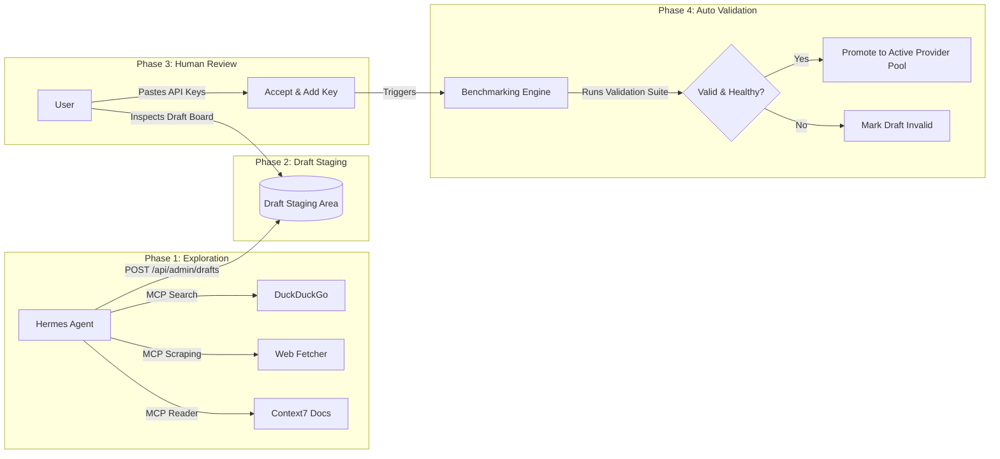

# Document 06 — Autonomous Benchmarking & Discovery Architecture

**Purpose**: Complete architectural specification for the Autonomous LLM Benchmarking, Silent Throttle Engine, and Agentic Provider Discovery Subsystem.

**Last Updated**: 2026-08-18

## 1. Executive Summary & Core Objectives

The **Autonomous Benchmarking and Provider Discovery Subsystem** upgrades the Local Multi-Provider LLM Router from a passive failover gateway into an active performance optimizer and endpoint discovery engine.

### Core Goals

1. **Detect Silent Throttling**: Identify upstream providers that return HTTP 200 OK status codes but artificially constrain generation throughput or delay first tokens under load.
2. **Target-Threshold Benchmarking**: Test API keys up to required target metrics (e.g., target $60$ Tokens Per Second or $10$ Requests Per Minute) rather than driving keys to hard failure or token exhaustion.
3. **Automated Cooldown Management**: Lock keys under test into an isolated testing state, running parallel benchmarks with built-in cooldown delays between metric phases.
4. **Agentic Provider Discovery**: Utilize an isolated **Hermes Agent** running inside a Docker sandbox equipped with Model Context Protocol (MCP) servers (DuckDuckGo, Web Fetch, Context7) to scrape known public sources for free/low-cost LLM endpoints.
5. **Human-in-the-Loop Intake**: Stage discovered endpoints as draft records, allowing the user to inspect findings, supply API keys, and automatically validate them before adding them to active routing pools.

## 2. System Topology & Container Boundaries

The system operates across two main environments: the core **LLM Router Host Environment** and an isolated **Hermes Agent Docker Sandbox**. Both components communicate over an internal bridge network using REST calls to the router's Admin API.

## 3. Automated Benchmarking & Silent Throttle Engine

### 3.1 Concept: Silent Throttling vs. Hard Errors

Traditional gateways only react to explicit failure status codes (`429 Too Many Requests`, `402 Payment Required`, `5xx Server Errors`). However, many budget and free-tier LLM providers implement **silent throttling**: instead of rejecting requests, they queue requests internally, causing:

- Massive Time to First Token (*TTFT*) delays (**> 5s**).
- Extreme Inter-Token Latency (*ITL*) fluctuations.
- Token Per Second (*TPS*) degradation below usability limits.

The Benchmarking Engine periodically executes synthetic agentic coding workflows to measure latency metrics and detect drift against an established **Baseline Model**.

### 3.2 Synthetic Agentic Coding Workflow Test

Instead of single fixed prompts, the benchmark executes a multi-turn, multi-tool synthetic prompt loop that mimics real agent workload behavior:

### 3.3 Benchmarking Mathematics & Throttle Formulas

**1. Time to First Token (*TTFT*)**

Defined as the elapsed time from sending the request to receiving the first non-empty text content chunk:

$$T_{\text{FT}} = t_{\text{first\_token}} - t_{\text{request\_sent}}$$

**2. Inter-Token Latency (*ITL*) & Generation Speed (*TPS*)**

For a stream yielding $N$ content tokens at arrival timestamps $t_1, t_2, \ldots, t_N$:

$$ITL_i = t_i - t_{i-1} \quad \text{for } i \in \{2, \ldots, N\}$$

$$TPS = \frac{N-1}{\sum_{i=2}^{N} ITL_i} = \frac{N-1}{t_N - t_1}$$

**3. Baseline Calibration & Latency Drift Ratio**

During initial setup, a known stable API key (e.g., standard Claude 3.5 Sonnet or OpenAI GPT-4o key) is designated as the **Baseline Reference**. The system records baseline benchmark values $T_{\text{FT, baseline}}$ and $TPS_{\text{baseline}}$.

When testing any provider key $k$, the engine calculates the **Latency Drift Ratios**:

$$\delta_{\text{TTFT}} = \frac{T_{\text{FT, observed}}(k)}{T_{\text{FT, baseline}}}$$

$$\delta_{\text{TPS}} = \frac{TPS_{\text{baseline}}}{TPS_{\text{observed}}(k)}$$

**4. Silent Throttling Decision Logic**

A key is flagged as **Silently Throttled** if either drift ratio exceeds configured tolerance multipliers ($\theta_{\text{TTFT\_max}}$ or $\theta_{\text{TPS\_max}}$):

$$
\text{IsThrottled}(k) =
\begin{cases}
\text{true} & \text{if } \delta_{\text{TTFT}} > \theta_{\text{TTFT\_max}} \text{ OR } \delta_{\text{TPS}} > \theta_{\text{TPS\_max}} \\
\text{false} & \text{otherwise}
\end{cases}
$$

Default Multipliers:

- $\theta_{\text{TTFT\_max}} = 2.5$ (First token took more than $2.5\times$ baseline time).
- $\theta_{\text{TPS\_max}} = 2.0$ (Generation speed was less than $50\%$ of baseline speed).

### 3.4 Target-Threshold Limit Strategy (Early Stopping)

To prevent draining account balances, exhausting daily token quotas, or triggering upstream safety bans, the Benchmarking Engine implements **Target-Threshold Early Stopping**:

- **Max Target Limits**: Users define maximum operational requirements in system settings (e.g., Target $TPS = 60$, Target $RPM = 15$).
- **Pass & Advance Criteria**: As soon as a test run observes that an API key satisfies the configured target requirements, the metric test terminates immediately with a PASS status without pushing to the key's absolute ceiling.
- **Cooldown Delays**: Because RPM tests intentionally hit rate limits, the test module executes a mandatory waiting window before transitioning to the next test phase, allowing provider sliding-window meters to clear.

## 4. Key Lifecycle State Machine Extensions

To isolate keys undergoing benchmarks and handle throttle-based deprioritization, the existing state machine is updated with two new operational states: TESTING and COOLDOWN.

### 4.1 State Definitions

| Status | Meaning | Live Routing Action | Transition Trigger |
|---|---|---|---|
| ACTIVE | Fully operational | Included in Tier 1 | Passed benchmark or penalty cleared |
| TESTING | Undergoing benchmarking | Excluded from gateway | Selected by Benchmark Scheduler |
| COOLDOWN | Post-test recovery buffer | Excluded from gateway | Benchmark completed; waiting for provider limits to reset |
| PENALIZED | Temporarily deprioritized | Included in Tier 2 (Fallback) | Transient failure or Throttling detected |
| SUSPENDED | Excluded permanently | Excluded | Quota exceeded or Invalid credentials |
| DISABLED | Disabled by admin | Excluded | Manually toggled |

### 4.2 State Transition Diagram

## 5. Parallel Execution & Concurrency Architecture

The benchmark engine can evaluate multiple API keys concurrently across different providers. However, keys belonging to the **same provider account** must be queued sequentially to avoid aggregate account-level rate limit interference.

### Concurrency Rules

1. **Global Concurrency Limit**: Controlled by setting benchmarkMaxParallelTests (Default: $3$).
2. **Per-Provider Serialization**: Only one key per providerId may enter the TESTING state at any given moment.
3. **Gateway Lock Out**: When a key status updates to TESTING, the central orchestrator's buildCandidates() function instantly excludes it from live user routing requests.

## 6. Agentic Discovery Pipeline (Hermes Agent & MCP Integration)

The discovery subsystem uses **Hermes Agent** running in Docker to search external sources, scrape API documentation, identify free/cheap LLM endpoints, and stage them as **Draft Providers**.

### 6.1 Discovery & Onboarding Lifecycle

### 6.2 Model Context Protocol (MCP) Capabilities

Hermes Agent utilizes three primary MCP server adapters:

1. **DuckDuckGo MCP** (duckduckgo-search):
   - Executed queries: *"Free OpenAI compatible API endpoints"*, *"Hosted LLM providers API keys documentation"*, *"DeepSeek API alternative providers"*.
2. **Fetch MCP** (web-fetcher):
   - Scrapes structured JSON and HTML pages from developer documentation portals, GitHub repositories, and community endpoint lists.
   - Extracts target Base URLs, supported API formats (CHAT_COMPLETIONS, MESSAGES, RESPONSES), model names, and rate limit documentation.
3. **Context7 MCP** (context7-docs):
   - Parses official API documentation to automatically identify required headers, authentication schemas, and parameter quirks.

### 6.3 Draft Provider & Key Staging Schema

Discovered endpoints are stored in a staging state until confirmed by the user:

- **Draft Provider Record**:
  - Base URL.
  - Extracted API Protocol Format.
  - Discovered Model List.
  - Source URL / Discovery Context.
  - Status: PENDING_KEY, READY_FOR_TESTING, VALIDATED, REJECTED.
- **Draft Key Staging**:
  - User inputs the key secret into a dedicated Admin UI intake board.
  - Once supplied, the router automatically triggers the Benchmark Engine to validate the key against the discovered endpoint.

## 7. Data Layer Extensions (Database Schema Requirements)

To support benchmarking, silent throttling tracking, and draft staging, the SQLite/libSQL database schema requires the following extensions.

### 7.1 Enum Extensions

**ApiKeyStatus**

- ACTIVE: Fully operational for gateway requests.
- PENALIZED: Deprioritized due to failures or silent throttling.
- SUSPENDED: Excluded permanently due to terminal auth/quota errors.
- DISABLED: Manually disabled by admin.
- TESTING: Locked during benchmarking execution.
- COOLDOWN: Post-benchmark cooling period.

**DraftStatus**

- PENDING_KEY: Discovered endpoint waiting for user API key.
- TESTING: Undergoing initial validation suite.
- ACCEPTED: Passed validation and converted to active Provider/Pool.
- REJECTED: Validation failed or rejected by user.

### 7.2 Entity Specifications

**Entity: ApiKeyBenchmark**

Stores historical benchmark metrics per execution run.

| Field Name | Type | Constraints / Nullable | Purpose |
|---|---|---|---|
| id | String | Primary Key (CUID) | Unique benchmark run ID |
| apiKeyId | String | Foreign Key → ApiKey | Targeted API key |
| ttftMs | Integer | Required | Time to First Token in milliseconds |
| avgTps | Float | Required | Observed Tokens Per Second |
| latencyDriftRatio | Float | Required | Calculated drift against baseline model |
| isThrottled | Boolean | Default: false | True if drift exceeded tolerance thresholds |
| passed | Boolean | Required | Overall test result |
| failureReason | String | Nullable | Detailed failure description |
| testedAt | DateTime | Default: now() | Timestamp of benchmark run |

**Entity: BenchmarkConfig**

Singleton table storing benchmarking rules and throttle limits.

| Field Name | Type | Default Value | Purpose |
|---|---|---|---|
| id | String | "singleton" | Single settings row |
| baselineProviderModelId | String | Nullable | Reference model ID for latency comparison |
| targetTps | Float | 60.0 | Target throughput threshold (Early stopping ceiling) |
| targetRpm | Integer | 15 | Target request rate threshold |
| ttftDriftThreshold | Float | 2.5 | Max allowable TTFT drift multiplier ($2.5\times$) |
| tpsDriftThreshold | Float | 2.0 | Max allowable TPS drift multiplier ($2.0\times$) |
| postTestCooldownSeconds | Integer | 120 | Mandatory cooldown delay after test run |
| maxParallelTests | Integer | 3 | Global concurrent benchmark limit |

**Entity: DraftProvider**

Stores discovered LLM providers awaiting key assignment and verification.

| Field Name | Type | Constraints / Nullable | Purpose |
|---|---|---|---|
| id | String | Primary Key (CUID) | Unique draft ID |
| name | String | Required | Extracted provider name |
| baseUrl | String | Required | Upstream API endpoint URL |
| apiFormat | String | Required | Protocol format (CHAT_COMPLETIONS, etc.) |
| sourceUrl | String | Nullable | URL where endpoint was discovered |
| status | Enum | Default: PENDING_KEY | Draft lifecycle status |
| discoveredModels | String (JSON) | Required | List of extracted model IDs and capabilities |
| createdAt | DateTime | Default: now() | Discovery timestamp |

## 8. Admin User Interface Extensions

The Admin Dashboard is extended with three dedicated view modules:

### 8.1 Live Benchmarking Dashboard (/benchmarks)

- **Live Progress View**: Displays active benchmark tests, current step (TTFT, TPS, Cooldown), elapsed time, and real-time streaming latency charts.
- **Key Testing Queue**: Shows queued keys waiting for provider lock availability.
- **Throttle Analytics Matrix**: Visual comparison table displaying latency drift ratios ($\delta_{\text{TTFT}}$, $\delta_{\text{TPS}}$) across all registered API keys vs. the baseline model.

### 8.2 Provider Discovery & Draft Board (/discovery)

- **Agent Status Control**: Run, pause, or schedule Hermes Agent discovery sessions.
- **Draft Intake Board**: Interactive cards showing discovered endpoints, extracted models, and discovery source links.
- **One-Click Key Handover**: Inline secret input fields allowing the user to paste an API key for a draft provider and click "Validate & Onboard".

### 8.3 Throttle & Calibration Settings (/settings#benchmarks)

- **Baseline Selection**: Dropdown menu to pick the anchor model used for calculating baseline metrics.
- **Target Limits Configuration**: Numerical inputs for Target TPS, Target RPM, and maximum drift tolerance multipliers.

## 9. Implementation Roadmap & Integration Checklist

### Phase 1: Engine Core & Metrics Collection

- [ ] Add TESTING and COOLDOWN states to ApiKeyStatus enum.
- [ ] Implement ApiKeyBenchmark and BenchmarkConfig database tables.
- [ ] Build synthetic agentic workflow prompt suite (multi-turn tool execution simulation).
- [ ] Build streaming response observer to calculate $T_{\text{FT}}$, $ITL$, and $TPS$.

### Phase 2: Silent Throttling & State Machine Mechanics

- [ ] Implement baseline calibration engine and drift calculation formulas.
- [ ] Update orchestrator.ts to skip TESTING and COOLDOWN status keys during gateway candidate selection.
- [ ] Build parallel benchmarking task scheduler with per-provider mutex locks.
- [ ] Implement early stopping logic based on target metric thresholds.

### Phase 3: Agent Sandbox & MCP Discovery Setup

- [ ] Configure Hermes Agent Docker environment with bridge network exposure to http://llm-router:4006/api/admin.
- [ ] Integrate DuckDuckGo, Web Fetch, and Context7 MCP server containers.
- [ ] Create DraftProvider staging database tables and Admin REST endpoints (/api/admin/drafts).
- [ ] Develop agent prompt templates for exploring public repos, extracting API details, and staging draft records.

### Phase 4: UI & Visual Analytics Integration

- [ ] Build /benchmarks page with real-time test progress tracking and latency drift matrices.
- [ ] Build /discovery page for draft endpoint review and key handover.
- [ ] Add benchmark configuration panels to /settings.
