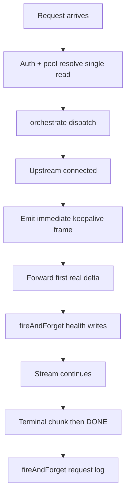

# 10 — Universal Client Fidelity & TTFT Reduction Plan

**Status:** ✅ IMPLEMENTED — all phases shipped with the recommended defaults
**Date:** 2026-09-10
**Author:** Architect (via Orchestrator); implemented in Code mode
**Scope:** `src/engine/**`, `src/app/api/gateway/v1/chat/completions/route.ts`, `src/lib/api-formats.ts`, `scripts/verify-*.ts`, `prisma/schema.prisma`

> This document is a **plan only**. It prescribes minimal-diff, backward-compatible changes but implements nothing. Every claim about our code carries a `file:line` citation.

---

## 1. Executive summary

Our router was engineered around a single flagship consumer: **GitHub Copilot / VS Code**. That drove design decisions that are *correct for Copilot but actively harmful for generic OpenAI-compatible agent clients*. Two user-visible problems result.

### Problem A — Agents "over-think", over-do tasks, and loop

**Root-cause thesis (one paragraph):** When a non-Copilot client talks to us, the assistant turns we hand back are *semantically incomplete in ways that client cannot interpret*. Reasoning is emitted only into `reasoning` / `reasoning_content` fields that Copilot renders but generic clients ignore, producing **visually empty assistant turns** ([`src/engine/adapters/stream-helpers.ts:11`](src/engine/adapters/stream-helpers.ts:11), [`src/engine/serializer.ts:23`](src/engine/serializer.ts:23)). On the Anthropic path the request side is worse: assistant `tool_calls` are **dropped** and `tool`-role results are **not** converted to `tool_result` ([`src/engine/adapters/messages.ts:43`](src/engine/adapters/messages.ts:43)), so the tool result arrives detached from its call and the model re-issues the same tool forever. We also inject a Copilot-only `askQuestion` `[ROUTER-GUIDANCE]` block into *any* pooled client ([`src/app/api/gateway/v1/chat/completions/route.ts:154`](src/app/api/gateway/v1/chat/completions/route.ts:154)), making non-Copilot agents hallucinate a tool they do not have. An agent that sees an empty turn (or a dangling tool result, or an instruction to call a nonexistent tool) does the only thing it can: **re-plans and retries**. That is the loop.

### Problem B — 5–10 s delay before the first streamed token

**Root-cause thesis (one paragraph):** The first byte is held hostage to *synchronous bookkeeping*. Before the response stream is even constructed, `orchestrate()` awaits two unconditional DB `updateMany` calls ([`src/engine/orchestrator.ts:229`](src/engine/orchestrator.ts:229)), and immediately after upstream success it awaits a DB health reset and an auto-calibration write *before* the generator is returned ([`src/engine/orchestrator.ts:773`](src/engine/orchestrator.ts:773), [`src/engine/orchestrator.ts:777`](src/engine/orchestrator.ts:777)). The gateway route performs three redundant Prisma round-trips before any provider contact ([`src/app/api/gateway/v1/chat/completions/route.ts:65`](src/app/api/gateway/v1/chat/completions/route.ts:65), [:74](src/app/api/gateway/v1/chat/completions/route.ts:74), [:95](src/app/api/gateway/v1/chat/completions/route.ts:95)). Because the database is libsql/SQLite over a file ([`src/lib/prisma.ts:8`](src/lib/prisma.ts:8)), every write serializes on a **file lock**; a handful of on-path writes becomes seconds of dead air. Upstream calls use a plain global `fetch()` with no keep-alive pooling ([`src/engine/routing/attempt.ts:42`](src/engine/routing/attempt.ts:42)), so each request pays TCP/TLS setup again.

### Expected outcome of this plan

- Generic OpenAI-compatible agents receive **self-describing turns**: reasoning is surfaced in a field every client renders (or bridged), tool results are always anchored, and Copilot-only guidance never leaks.
- Time-to-first-token drops to roughly **upstream TTFT + one thin dispatch hop**, by moving all bookkeeping off the synchronous hot path and reusing upstream connections.
- **Verbose default remains Copilot-compatible**; universal behavior is opt-in/configurable and cannot regress Copilot.

---

## 2. Root-cause analysis

### 2.1 Loop / over-think causes (Problem A)

| Defect | Symptom it causes | Severity | File:line | Why it happens |
|---|---|---|---|---|
| **D3** | Empty-looking assistant turns → agent re-plans | High | [`src/engine/adapters/stream-helpers.ts:11`](src/engine/adapters/stream-helpers.ts:11), [`src/engine/serializer.ts:23`](src/engine/serializer.ts:23) | Reasoning is written only to `reasoning` / `reasoning_content`. Copilot renders these; generic clients ignore them, so a reasoning-only turn serializes to no usable text. The file comment states bridging is *deliberately avoided* for Copilot. |
| **D4** | Same tool re-issued forever (detached results) | High | [`src/engine/adapters/messages.ts:43`](src/engine/adapters/messages.ts:43) | The Anthropic adapter builds `{role, content}` and never copies `msg.tool_calls`; a `tool`-role message is emitted as `role:"tool"` instead of an Anthropic `tool_result` block. The upstream model cannot correlate results to calls. |
| **D5** | Non-Copilot agents hallucinate a nonexistent tool | High | [`src/app/api/gateway/v1/chat/completions/route.ts:154`](src/app/api/gateway/v1/chat/completions/route.ts:154), [`src/engine/playground/injection.ts:30`](src/engine/playground/injection.ts:30) | `takePendingInjection` fires for any pooled client and prepends `[ROUTER-GUIDANCE]` telling the model to use `askQuestion` — a Copilot-only tool. |
| **D10** | Agentic clients silently lose tools | Med | [`src/engine/orchestrator.ts:599`](src/engine/orchestrator.ts:599), [`src/engine/routing/empty-completion.ts:18`](src/engine/routing/empty-completion.ts:18) | `reliableToolCalls:false` models get `withoutTools()` applied, stripping `tools` and `tool_choice` outright. Intended for one free model, but it removes autonomy for *any* client on those models. |
| **D6** | Anthropic `thinking` never becomes reasoning | Med | [`src/engine/adapters/messages.ts:95`](src/engine/adapters/messages.ts:95), [:175](src/engine/adapters/messages.ts:175) | `parseResponse` reads only `text` / `tool_use` blocks; `parseStreamChunk` handles only `text_delta` / `input_json_delta`. `thinking` / `thinking_delta` are dropped. |
| **D7** | Real tool-call turn overwritten by synthetic stop | Med | [`src/engine/orchestrator.ts:1101`](src/engine/orchestrator.ts:1101), [`src/app/api/gateway/v1/chat/completions/route.ts:286`](src/app/api/gateway/v1/chat/completions/route.ts:286) | A synthetic `finish_reason:"stop"` is injected whenever `sawTerminal` is false / `hasTerminal` is false — it does not check whether tool calls were actually produced. |
| **D8** | Responses adapter collapses all terminals to `stop` | Med | [`src/engine/adapters/responses.ts:191`](src/engine/adapters/responses.ts:191) | The ternary is `status === "completed" ? "stop" : "stop"` — a literal no-op that discards tool-call intent. |
| **D9** | Images dropped for every client | Med | [`src/engine/adapters/chat-completions.ts:31`](src/engine/adapters/chat-completions.ts:31) | Request content is filtered to `type === "text"` parts only; `image_url` parts are discarded before the upstream call. |
| **D13** | Empty choices → forced empty `"stop"` message | Low | [`src/engine/response-normalizer.ts:8`](src/engine/response-normalizer.ts:8) | Zero-choice responses are replaced by an empty assistant message with `finish_reason:"stop"`, fabricating a "finished answer". |
| **D14** | Copilot meta-tag stripping may collide foreign sessions | Low | [`src/engine/routing/session-id.ts:88`](src/engine/routing/session-id.ts:88) | `META_TAG_NAMES` strips Copilot's workspace `<context>`/`<system>`-style XML. A non-Copilot client that legitimately sends these tags has its anchor text removed, risking session-id collisions. |
| **EXH** | Exhausted pool reads as a genuine final answer | Med | [`src/engine/routing/exhausted-pool.ts:4`](src/engine/routing/exhausted-pool.ts:4), [:53](src/engine/routing/exhausted-pool.ts:53), [:75](src/engine/routing/exhausted-pool.ts:75) | Designed so Copilot's mechanical tool loop ends. A generic agent also reads `finish_reason:"stop"` + no tool_calls as "task complete", silently swallowing a routing outage. |

### 2.2 TTFT causes (Problem B)

| Defect | Symptom it causes | Severity | File:line | Why it happens |
|---|---|---|---|---|
| **D1** | Post-fetch DB writes delay first byte | High | [`src/engine/orchestrator.ts:773`](src/engine/orchestrator.ts:773), [:777](src/engine/orchestrator.ts:777) | `resetKeyHealth` and `handleAutoCalibrationSuccess` are `await`ed after upstream success but **before** the stream generator is returned, so the client waits on two SQLite writes. |
| **D2** | Two writes per request at the very top of routing | High | [`src/engine/orchestrator.ts:229`](src/engine/orchestrator.ts:229) | `checkAndRecoverExpiredPenalties()` / `checkAndRecoverExpiredCooldowns()` run unconditionally on every `orchestrate()`, duplicating a background recovery loop started at boot (see [`src/instrumentation.ts`](src/instrumentation.ts)). |
| **D11** | Three redundant Prisma reads before any provider contact | Med | [`src/app/api/gateway/v1/chat/completions/route.ts:65`](src/app/api/gateway/v1/chat/completions/route.ts:65), [:74](src/app/api/gateway/v1/chat/completions/route.ts:74), [:95](src/app/api/gateway/v1/chat/completions/route.ts:95) | Pool-auth lookup + `appSettings` lookup + full pool resolve are separate sequential queries; the auth pool lookup overlaps the full resolve. |
| **D12** | Pre-dispatch wait up to 60 s | Med | [`src/engine/rate-limit/api-key-rate-limiter.ts:138`](src/engine/rate-limit/api-key-rate-limiter.ts:138) | `delay(waitMs)` inside the reservation loop is uncapped; a client waits on the rate limiter rather than failing over to another key. |
| **KEEPALIVE** | TCP/TLS handshake on every attempt | Med | [`src/engine/routing/attempt.ts:42`](src/engine/routing/attempt.ts:42) | Plain global `fetch()` reuses no dispatcher; each attempt re-establishes the connection. |
| **D15** | Streaming path writes a log row before returning bytes | Low | [`src/app/api/gateway/v1/chat/completions/route.ts:528`](src/app/api/gateway/v1/chat/completions/route.ts:528) | `await createRequestLog(...)` sits between stream construction and `return new Response(stream)`. |
| **DB-LOCK** | Amplifies every on-path write | High (amplifier) | [`src/lib/prisma.ts:8`](src/lib/prisma.ts:8) | libsql/SQLite serializes writers on a file lock, so each awaited write on the hot path costs far more than a networked DB round-trip would. |

---

## 3. Algorithm selection rationale

We adopt a focused subset of OmniRouter's streaming/idempotency algorithms. Each adopted technique is chosen **because it fixes a specific defect we already confirmed**, not for completeness.

### 3.1 Adopted techniques → defect mapping

| OmniRouter technique | Reference | Defect it fixes | Why we adopt it |
|---|---|---|---|
| Reasoning preserved and normalized; mixed reasoning+content split into two sequential deltas | OmniRouter `open-sse/utils/stream.ts:1840`, `translator/response/claude-to-openai.ts:130` | **D3**, **D6** | Guarantees a client never loses the first token and never sees an empty turn. We already normalize reasoning ([`src/engine/adapters/stream-helpers.ts:26`](src/engine/adapters/stream-helpers.ts:26)); we extend it with a universal client option that also bridges. |
| `finish_reason` force-normalized to `tool_calls` whenever tool calls are present | `open-sse/utils/stream.ts:1986`, `handlers/responseTranslator.ts:601` | **D7**, **D8**, **EXH** | Our synthetic `"stop"` injection ([`src/engine/orchestrator.ts:1101`](src/engine/orchestrator.ts:1101)) and the responses ternary ([`src/engine/adapters/responses.ts:191`](src/engine/adapters/responses.ts:191)) both discard terminal intent. |
| Non-empty `reasoning_content` counts as valid output | `open-sse/services/combo/validateQuality.ts:704` | **D13**, reasoning-only misclassification | Our `isBareDelta` ([`src/engine/adapters/stream-helpers.ts:48`](src/engine/adapters/stream-helpers.ts:48)) already counts reasoning, but the empty-choices normalizer ([`src/engine/response-normalizer.ts:8`](src/engine/response-normalizer.ts:8)) does not. |
| System-prompt injection off by default + idempotency guard (`body._skipSystemPrompt`) | `open-sse/services/systemPrompt.ts:88` | **D5** | Our `[ROUTER-GUIDANCE]` injection ([`src/app/api/gateway/v1/chat/completions/route.ts:154`](src/app/api/gateway/v1/chat/completions/route.ts:154)) is unconditional. |
| Streaming-first: first chunk forwarded immediately; immediate keepalive frame while upstream is cold; opening-window holdback OFF | `open-sse/utils/stream.ts:685`, `utils/earlyStreamKeepalive.ts:216`, `config/constants.ts:344` | **D1**, **D2**, **D15**, **KEEPALIVE** | Directly attacks our held first byte. |
| Keep-alive connection pooling (undici Agent, round-robin dispatchers) | `open-sse/utils/proxyFetch.ts:41` | **KEEPALIVE** | Removes repeated TLS setup from every attempt ([`src/engine/routing/attempt.ts:42`](src/engine/routing/attempt.ts:42)). |
| No unconditional pre-flight upstream call (quota preflight is opt-in) | `open-sse/services/quotaPreflight.ts:1` | **D11**, **D12** | Confirms our pre-dispatch work should be minimal and never blocking by default. |
| Routing/health/DB bookkeeping fire-and-forget off the synchronous path | `docs/architecture/ADAPTIVE_ROUTING.md:112` | **D1**, **D2**, **D15**, **DB-LOCK** | The single highest-leverage change for TTFT. |

### 3.2 Deliberately **not** adopted (and why)

| Technique | Decision | Rationale |
|---|---|---|
| 16-factor adaptive scoring | **Deferred** | Our routing already has a working strategy layer ([`src/engine/routing/strategies.ts`](src/engine/routing/strategies.ts)). Replacing scoring is a large, risky rewrite unrelated to either symptom. Out of scope. |
| Compression ladders / prompt compaction | **Deferred** | Compaction was explicitly pivoted to the VS Code extension ([`prisma/schema.prisma:224`](prisma/schema.prisma:224)); reintroducing it in the gateway adds latency and risk. Out of scope. |
| Opening-window holdback + holdback recovery | **Not adopted** | Holdback *increases* TTFT by design. It is the opposite of Problem B's fix. |
| Full Anthropic↔OpenAI bidirectional translation layer | **Partially adopted** | We adopt only the `tool_result` + `thinking` mappings required by **D4** and **D6**, not a general translator. Keeps blast radius small. |
| Universal streaming state machine rewrite | **Not adopted** | Our per-format adapters ([`src/engine/adapters/index.ts:8`](src/engine/adapters/index.ts:8)) already isolate format differences. A rewrite would violate the minimal-diff constraint. |

---

## 4. Client-capability detection design

### 4.1 Goal

Preserve today's Copilot behavior byte-for-byte while giving at least one generic profile (`universal`) correct fidelity behavior. Backward-compatible and configurable.

### 4.2 Resolution order (first match wins)

1. **Explicit per-request override** — request header `x-router-client-profile: copilot | universal`. Highest priority; lets a user pin behavior without a deploy.
2. **Configured default** — new env var `ROUTER_DEFAULT_CLIENT_PROFILE` (default `copilot`), read once at boot. Keeps current behavior the default.
3. **Heuristic detection** — inspect request headers already available at [`src/app/api/gateway/v1/chat/completions/route.ts:142`](src/app/api/gateway/v1/chat/completions/route.ts:142) (`request.headers`):
   - `editor-version` present, or `user-agent` matching `/GitHubCopilotChat|Copilot/`, or `copilot-integration-id` present → `copilot`.
   - Otherwise → the configured default (still `copilot` unless changed).

> Note: detection never keys off prompt content and never changes routing/keys — only serialization/fidelity behavior. This keeps it safe and reversible.

### 4.3 Implementation shape

Add `src/engine/clients/client-profile.ts`:

```ts
export type ClientProfile = "copilot" | "universal";

export interface ClientCapabilities {
  rendersReasoningFields: boolean; // Copilot: true
  bridgeReasoningToContent: boolean; // Copilot: false, universal: true
  supportsAskQuestionInjection: boolean; // Copilot: true, universal: false
  splitMixedDelta: boolean; // Copilot: false, universal: true
}

export function resolveClientProfile(headers: Headers): ClientProfile {
  const override = headers.get("x-router-client-profile");
  if (override === "copilot" || override === "universal") return override;
  const env = process.env.ROUTER_DEFAULT_CLIENT_PROFILE;
  const fallback: ClientProfile = env === "universal" ? "universal" : "copilot";
  const ua = (headers.get("user-agent") ?? "").toLowerCase();
  const isCopilot =
    headers.has("editor-version") ||
    headers.has("copilot-integration-id") ||
    ua.includes("githubcopilotchat") ||
    ua.includes("copilot");
  return isCopilot ? "copilot" : fallback;
}

export function capabilitiesFor(profile: ClientProfile): ClientCapabilities {
  return profile === "universal"
    ? { rendersReasoningFields: false, bridgeReasoningToContent: true, supportsAskQuestionInjection: false, splitMixedDelta: true }
    : { rendersReasoningFields: true, bridgeReasoningToContent: false, supportsAskQuestionInjection: true, splitMixedDelta: false };
}
```

The resolved `ClientCapabilities` is threaded through `OrchestrateOptions` so adapters/serializer can consult it without importing route-level state.

### 4.4 Backward-compatibility guarantee

With default `copilot`, `capabilitiesFor("copilot")` is identical to today's behavior: reasoning untouched in `reasoning*` fields, no bridging, injection allowed. **No existing Copilot path changes unless the operator opts in.**

---

## 5. Fix specifications

### Workstream A — Fidelity (Problem A)

#### A1 — D3: Bridge reasoning → content for non-Copilot clients

- **Goal:** A reasoning-only turn must never render as an empty assistant message for clients that ignore `reasoning`/`reasoning_content`.
- **Approach:** Add `bridgeReasoningToContent(delta, caps)` in [`src/engine/adapters/stream-helpers.ts`](src/engine/adapters/stream-helpers.ts). When `caps.bridgeReasoningToContent` is true and a delta carries reasoning but no `content`, emit `content` = the reasoning text (keep the reasoning fields too, so dual-capable clients still see them). When `caps.splitMixedDelta` is true and a delta carries **both** content and reasoning, split into two sequential deltas (reasoning first, then content) so no client drops the first token.
- **Files/functions:** [`src/engine/adapters/stream-helpers.ts:26`](src/engine/adapters/stream-helpers.ts:26) (extend near `normalizeReasoningDelta`); [`src/engine/serializer.ts:39`](src/engine/serializer.ts:39) `serializeDelta`; [`src/engine/serializer.ts:8`](src/engine/serializer.ts:8) `serializeResponse` for the non-streamed message ([`src/engine/serializer.ts:23`](src/engine/serializer.ts:23)).
- **Pseudocode:**

```ts
export function bridgeReasoningToContent(choice, caps): CanonicalDeltaChoice {
  const d = choice.delta ?? {};
  const reasoning = d.reasoning_content ?? d.reasoning;
  if (caps.bridgeReasoningToContent && reasoning && !d.content) {
    return { ...choice, delta: { ...d, content: reasoning } }; // keep reasoning too
  }
  return choice; // copilot path unchanged
}
```

- **Risks/regressions:** If bridging is enabled for a Copilot request, reasoning would double-render as answer text (the exact behavior the current comment at [`src/engine/adapters/stream-helpers.ts:11`](src/engine/adapters/stream-helpers.ts:11) warns about). Mitigation: bridge only when `caps.bridgeReasoningToContent`; covered by config default `copilot`.
- **Rollback:** Set `ROUTER_DEFAULT_CLIENT_PROFILE=copilot` (default) or remove `x-router-client-profile: universal`.

#### A2 — D4: Anthropic `tool_calls` + `tool_result` forwarding

- **Goal:** Tool results on the Anthropic path must anchor to their originating call.
- **Approach:** In `messagesAdapter.buildRequest` ([`src/engine/adapters/messages.ts:43`](src/engine/adapters/messages.ts:43)):
  1. For an assistant message with `msg.tool_calls`, emit `content` blocks of `{ type: "tool_use", id, name, input }` (parse `arguments` JSON).
  2. For a `tool`-role message, emit a **user** message containing `{ type: "tool_result", tool_use_id: msg.tool_call_id, content: [...] }` (Anthropic requires `tool_result` inside a `user` turn).
- **Files/functions:** [`src/engine/adapters/messages.ts:43`](src/engine/adapters/messages.ts:43) (message mapper); add helper `toAnthropicContentBlocks(msg)` and `toAnthropicToolResult(msg)` in the same file.
- **Pseudocode:**

```ts
if (msg.role === "assistant" && msg.tool_calls?.length) {
  const blocks = [...textBlocks, ...msg.tool_calls.map(tc => ({
    type: "tool_use", id: tc.id, name: tc.function.name,
    input: safeJsonParse(tc.function.arguments),
  }))];
  return { role: "assistant", content: blocks };
}
if (msg.role === "tool") {
  return { role: "user", content: [{
    type: "tool_result", tool_use_id: msg.tool_call_id,
    content: [{ type: "text", text: normalizeContent(msg.content) }],
  }]};
}
```

- **Risks/regressions:** Providers that reject unknown block shapes. Mitigation: gate on `provider.apiFormat === "MESSAGES"` only (already per-adapter), which is exactly where these shapes belong.
- **Rollback:** Revert the single mapper function; chat-completions path ([`src/engine/adapters/chat-completions.ts:47`](src/engine/adapters/chat-completions.ts:47)) is the unaffected reference.

#### A3 — D5: Scope `[ROUTER-GUIDANCE]` injection to Copilot

- **Goal:** Never inject a Copilot-only tool instruction into a non-Copilot agent.
- **Approach:** At the injection site ([`src/app/api/gateway/v1/chat/completions/route.ts:154`](src/app/api/gateway/v1/chat/completions/route.ts:154)), guard with `caps.supportsAskQuestionInjection`. Additionally, add an idempotency guard (skip if the guidance block is already present in the outgoing messages), mirroring OmniRouter's `_skipSystemPrompt` pattern.
- **Files/functions:** [`src/app/api/gateway/v1/chat/completions/route.ts:152`](src/app/api/gateway/v1/chat/completions/route.ts:152), [`src/engine/playground/injection.ts:27`](src/engine/playground/injection.ts:27).
- **Pseudocode:**

```ts
if (pendingInjection && caps.supportsAskQuestionInjection && !alreadyInjected(messages)) {
  messages = [{ role: "system", content: buildInjection("compact_first", {...}) }, ...messages];
}
```

- **Risks/regressions:** Copilot users lose the prompt if detection misfires. Mitigation: default profile is `copilot`, so detection failure is fail-safe toward current behavior.
- **Rollback:** Remove the `caps.supportsAskQuestionInjection` conjunct.

#### A4 — D10: Make tool-stripping capability-aware

- **Goal:** Agentic clients keep their tools even when a model is flagged `reliableToolCalls:false`.
- **Approach:** In [`src/engine/orchestrator.ts:599`](src/engine/orchestrator.ts:599), only apply `withoutTools()` ([`src/engine/routing/empty-completion.ts:18`](src/engine/routing/empty-completion.ts:18)) when the resolved profile is `copilot`; for `universal`, keep tools and instead rely on the empty-completion detection to retry once *with* tools stripped as a fallback (bounded, single retry).
- **Files/functions:** [`src/engine/orchestrator.ts:599`](src/engine/orchestrator.ts:599), [`src/engine/routing/empty-completion.ts:27`](src/engine/routing/empty-completion.ts:27) (`hadTools` already exists for the fallback decision).
- **Pseudocode:**

```ts
const stripTools = member.reliableToolCalls === false && caps.bridgeReasoningToContent === false;
const requestForModel = stripTools ? withoutTools(canonicalRequest) : canonicalRequest;
```

- **Risks/regressions:** Universal clients on `stealth/ox-alpha`-class models may get one empty turn before fallback. Mitigation: bounded single retry using `hadTools()`.
- **Rollback:** Revert to unconditional `withoutTools()`.

#### A5 — D6: Map Anthropic `thinking` blocks to reasoning

- **Goal:** Preserve Anthropic-native thinking as reasoning, never drop it.
- **Approach:** In `parseResponse` ([`src/engine/adapters/messages.ts:95`](src/engine/adapters/messages.ts:95)) add a `block.type === "thinking"` branch that accumulates into `reasoning`. In `parseStreamChunk` ([`src/engine/adapters/messages.ts:175`](src/engine/adapters/messages.ts:175)) handle `delta.type === "thinking_delta"` → `{ reasoning: delta.thinking }` and `content_block_start` with `content_block.type === "thinking"`.
- **Files/functions:** [`src/engine/adapters/messages.ts:95`](src/engine/adapters/messages.ts:95), [:175](src/engine/adapters/messages.ts:175).
- **Pseudocode:**

```ts
// parseStreamChunk
if (delta.type === "thinking_delta") {
  return { choices: [{ index: 0, delta: { reasoning: delta.thinking as string } }] };
}
```

- **Risks/regressions:** A client that neither wants nor renders reasoning now receives it. Mitigation: D3 bridging decision (section 11 open question) governs whether it is bridged or merely passed through.
- **Rollback:** Remove the two branches; drops to current behavior.

#### A6 — D7/D8/EXH: Terminal-reason normalization

- **Goal:** `finish_reason` must reflect what actually happened: tool calls present ⇒ `tool_calls`.
- **Approach:** Add `normalizeTerminalReason(choices)` in [`src/engine/adapters/stream-helpers.ts`](src/engine/adapters/stream-helpers.ts) and a shared `resolveFinishReason(sawToolCalls, upstreamReason)`. Apply at:
  - synthetic terminal injection ([`src/engine/orchestrator.ts:1101`](src/engine/orchestrator.ts:1101)) — pass `sawToolCalls` so a tool-call turn is not overwritten with `"stop"`.
  - route terminal chunk ([`src/app/api/gateway/v1/chat/completions/route.ts:286`](src/app/api/gateway/v1/chat/completions/route.ts:286)).
  - responses adapter ([`src/engine/adapters/responses.ts:191`](src/engine/adapters/responses.ts:191)) — replace the no-op ternary with a real `status`→reason map.
  - exhausted pool ([`src/engine/routing/exhausted-pool.ts:53`](src/engine/routing/exhausted-pool.ts:53), [:75](src/engine/routing/exhausted-pool.ts:75)).
- **Pseudocode:**

```ts
export function resolveFinishReason(sawToolCalls: boolean, upstream: FinishReason): FinishReason {
  if (sawToolCalls) return "tool_calls";
  return upstream ?? "stop";
}
```

- **Risks/regressions:** Copilot depends on a terminal `"stop"` to emit `session.idle`. Mitigation: only override to `tool_calls` when calls were genuinely emitted; a normal text turn still ends `"stop"`.
- **Rollback:** Remove `resolveFinishReason` and inline the previous literal.

#### A7 — D9: Forward `image_url` parts on the chat-completions path

- **Goal:** Multimodal requests keep their images.
- **Approach:** In [`src/engine/adapters/chat-completions.ts:31`](src/engine/adapters/chat-completions.ts:31), instead of filtering to text, map `image_url` parts to OpenAI's `{ type: "image_url", image_url: { url } }` shape and keep text parts as-is. Only flatten to a string when the entry is all-text (the existing behavior preserved for the common case).
- **Files/functions:** [`src/engine/adapters/chat-completions.ts:28`](src/engine/adapters/chat-completions.ts:28).
- **Pseudocode:**

```ts
content: typeof msg.content === "string"
  ? msg.content
  : msg.content.every(c => c.type === "text")
    ? msg.content.map(c => c.text).join("")
    : msg.content.map(c => c.type === "image_url"
        ? { type: "image_url", image_url: c.image_url }
        : { type: "text", text: c.text })
```

- **Risks/regressions:** Providers without vision support may 400 on images. Mitigation: unchanged for string content; only multimodal requests change.
- **Rollback:** Restore the text-only filter.

#### A8 — D13: Do not fabricate an empty `"stop"` for zero choices

- **Goal:** Empty choices must not masquerade as a completed answer.
- **Approach:** In [`src/engine/response-normalizer.ts:8`](src/engine/response-normalizer.ts:8), only synthesize when the response has no signal whatsoever *and* the caller requests a fallback; otherwise surface the empty-shape so the routing layer can classify it (reasoning-only already counts as valid via [`src/engine/adapters/stream-helpers.ts:48`](src/engine/adapters/stream-helpers.ts:48)).
- **Risks/regressions:** A client may receive a well-formed-but-empty completion where it previously got a fabricated stop. Mitigation: gate behind universal profile; Copilot keeps the current normalizer.
- **Rollback:** Revert the guard.

#### A9 — D14: Make Copilot meta-tag stripping profile-aware

- **Goal:** Foreign session fingerprints are not mangled.
- **Approach:** Only strip `META_TAG_NAMES` ([`src/engine/routing/session-id.ts:88`](src/engine/routing/session-id.ts:88)) for the `copilot` profile; for `universal`, anchor on the full text (or a hash of the first user turn).
- **Files/functions:** [`src/engine/routing/session-id.ts:88`](src/engine/routing/session-id.ts:88), consumed at [`src/app/api/gateway/v1/chat/completions/route.ts:142`](src/app/api/gateway/v1/chat/completions/route.ts:142).
- **Risks/regressions:** Universal sessions may collide if their prompts are identical. Mitigation: hash of full text.
- **Rollback:** Revert to always stripping.

#### A10 — EXH: Make the exhausted-pool reply distinguishable

- **Goal:** A routing outage must be distinguishable from a real answer by non-Copilot agents.
- **Approach:** Keep `finish_reason:"stop"` (Copilot relies on it), but for `universal` prepend a machine-detectable marker to `EXHAUSTED_POOL_MESSAGE` ([`src/engine/routing/exhausted-pool.ts:21`](src/engine/routing/exhausted-pool.ts:21)) such as `[ROUTER-OUTAGE]`, so an agent (or wrapper) can detect and back off instead of treating it as completion.
- **Risks/regressions:** Marker text leaking into Copilot UX. Mitigation: marker only for universal profile.
- **Rollback:** Remove the marker prefix.

### Workstream B — TTFT (Problem B)

#### B1 — D1: Move post-success DB writes off the hot path

- **Goal:** Do not block the first byte on `resetKeyHealth` / `handleAutoCalibrationSuccess`.
- **Approach:** Introduce `fireAndForget(promise, label)` in a new `src/lib/async.ts` that logs rejections and never throws. Replace the `await`s at [`src/engine/orchestrator.ts:773`](src/engine/orchestrator.ts:773) and [:777](src/engine/orchestrator.ts:777) with `fireAndForget(...)`, then return/serve the stream. These operations are idempotent health-state writes — order relative to the client response is irrelevant.
- **Pseudocode:**

```ts
fireAndForget(resetKeyHealth(key.apiKeyId), "resetKeyHealth");
fireAndForget(handleAutoCalibrationSuccess(key.apiKeyId), "autoCalibration");
```

- **Risks/regressions:** A crash between success and the deferred write leaves health slightly stale. Mitigation: the boot recovery loop ([`src/instrumentation.ts`](src/instrumentation.ts)) reconciles.
- **Rollback:** Restore `await` on both lines.

#### B2 — D2: Remove per-request penalty/cooldown recovery writes

- **Goal:** Eliminate the two unconditional `updateMany` writes at [`src/engine/orchestrator.ts:229`](src/engine/orchestrator.ts:229).
- **Approach:** The boot-time background loop already recovers expired penalties/cooldowns. Remove the two awaited calls from `orchestrate()` and rely on the background loop; if a lazy check is still desired, wrap both in `fireAndForget()` **only when** a bounded staleness window has elapsed.
- **Files/functions:** [`src/engine/orchestrator.ts:229`](src/engine/orchestrator.ts:229), boot loop in [`src/instrumentation.ts`](src/instrumentation.ts).
- **Risks/regressions:** A just-expired penalty might not be reflected instantly. Mitigation: reduce background interval; the routing layer already tolerates a stale penalized key by skipping it.
- **Rollback:** Re-add the two awaited calls.

#### B3 — D11: Collapse the pre-dispatch Prisma reads

- **Goal:** One read instead of three before provider contact.
- **Approach:** In [`src/app/api/gateway/v1/chat/completions/route.ts:65`](src/app/api/gateway/v1/chat/completions/route.ts:65), fetch the pool once with `select: { gatewayKey: true }` **and** the full `include` ([`src/app/api/gateway/v1/chat/completions/route.ts:95`](src/app/api/gateway/v1/chat/completions/route.ts:95)) in a single query; cache `appSettings` ([`src/app/api/gateway/v1/chat/completions/route.ts:74`](src/app/api/gateway/v1/chat/completions/route.ts:74)) in-process (short TTL) since it is a singleton that changes only via admin UI.
- **Pseudocode:**

```ts
const pool = await prisma.pool.findUnique({ where: { virtualModelName: requestedModel }, include: { /* full resolve */ } });
const authed = pool?.gatewayKey === token || verifyGatewayKey(token, (await getAppSettingsCached()).unifiedGatewayKeyHash);
```

- **Risks/regressions:** Cached `appSettings` could serve a stale auth hash after a key rotation. Mitigation: invalidate on admin write, short TTL, and still verify the token cryptographically.
- **Rollback:** Restore the three separate queries.

#### B4 — D12: Cap the pre-dispatch rate-limit wait

- **Goal:** Never block a request on the limiter for tens of seconds; fail over instead.
- **Approach:** In [`src/engine/rate-limit/api-key-rate-limiter.ts:138`](src/engine/rate-limit/api-key-rate-limiter.ts:138), bound `waitMs` by a configurable `maxPreDispatchWaitMs` (default e.g. 1500 ms). When the wait would exceed the cap, return "not available" and let the orchestrator try the next key.
- **Risks/regressions:** More key rotation under heavy throttling. Mitigation: the strategy layer already handles rotation and recovery.
- **Rollback:** Remove the cap.

#### B5 — KEEPALIVE: Reuse upstream connections

- **Goal:** Remove repeated TCP/TLS setup from every attempt.
- **Approach:** In [`src/engine/routing/attempt.ts:42`](src/engine/routing/attempt.ts:42), replace the plain `fetch()` with one that uses a module-level undici `Agent({ keepAliveTimeout: 30_000, connections: N })` dispatcher (passed via `dispatcher`), round-robin if multiple. Node's global fetch accepts a dispatcher through `undici`; alternatively use `undici.request`.
- **Pseudocode:**

```ts
import { Agent } from "undici";
const dispatcher = new Agent({ keepAliveTimeout: 30_000, keepAliveMaxTimeout: 60_000 });
const response = await fetch(req.url, { method: "POST", headers, body, signal, dispatcher } as any);
```

- **Risks/regressions:** Longer-lived sockets; stale-connection reuse. Mitigation: keep-alive timeouts are bounded; on socket error the existing retry ([`src/engine/orchestrator.ts:612`](src/engine/orchestrator.ts:612)) re-attempts.
- **Rollback:** Remove the `dispatcher` option.

#### B6 — D15: Defer the direct-address log write

- **Goal:** Return the stream response before writing the log row.
- **Approach:** At [`src/app/api/gateway/v1/chat/completions/route.ts:528`](src/app/api/gateway/v1/chat/completions/route.ts:528), move `createRequestLog(...)` to run after `return new Response(stream)` — e.g. schedule it in the stream's `finally` (already the pattern at [:515](src/app/api/gateway/v1/chat/completions/route.ts:515)) or via `fireAndForget`.
- **Risks/regressions:** A crashed process may miss a log row. Mitigation: log is observability, not correctness.
- **Rollback:** Restore the `await`.

---

## 6. Streaming-architecture changes

### 6.1 First-byte-immediate design



Rules:
1. No `await` on any DB write between upstream success and returning the stream (fixes **D1**, **D2**, **D15**). All such writes become `fireAndForget`.
2. The ReadableStream is returned as soon as it is constructed ([`src/app/api/gateway/v1/chat/completions/route.ts:290`](src/app/api/gateway/v1/chat/completions/route.ts:290)), matching OmniRouter's streaming-first posture.

### 6.2 Optional keepalive frame (format-aware)

Add `buildKeepaliveFrame(profile)` in a new `src/engine/streaming/keepalive.ts`. It emits a **valid no-op** for the client format so strict SSE parsers do not choke:

- Chat Completions: `{ choices: [{ index: 0, delta: {} }] }` via `serializeDelta` ([`src/engine/serializer.ts:39`](src/engine/serializer.ts:39)).
- Anthropic-style clients: `event: ping` (the adapter already treats `ping` as `null` at [`src/engine/adapters/messages.ts:276`](src/engine/adapters/messages.ts:276), so it is safe and ignored).
- Writes one frame immediately after upstream connection, then again every `keepaliveIntervalMs` (e.g. 1000 ms) **only if no real delta has been emitted yet**. Disabled by default if it risks duplicate-render; enabled for universal profile where TTFT perception matters most.

### 6.3 Ordering guarantee: stream end vs logging

- The terminal chunk + `serializeStreamEnd()` are enqueued in the stream's `finally` ([`src/app/api/gateway/v1/chat/completions/route.ts:515`](src/app/api/gateway/v1/chat/completions/route.ts:515)) before `controller.close()`.
- Deferred writes (`createRequestLog`, health, calibration) are **scheduled after** terminal emission and carry no ordering dependency on close. If strict ordering is ever required, chain them on a per-request promise that resolves after `close()`, never blocking the stream.
- Rate-limit settlement already uses non-blocking settle at [`src/app/api/gateway/v1/chat/completions/route.ts:522`](src/app/api/gateway/v1/chat/completions/route.ts:522) — keep that pattern.

---

## 7. Staged rollout plan

### Phase 0 — Safety net & baseline

- **What changes:** Nothing functional. Add the `ClientCapabilities` plumbing with default `copilot` (dead code until used); snapshot current behavior with a TTFT baseline script; confirm tests green.
- **Why safe:** Pure scaffolding behind a default that equals today's behavior.
- **Verify:** Run existing suites — [`scripts/verify-tool-calls-forwarding.ts`](scripts/verify-tool-calls-forwarding.ts), [`scripts/verify-reasoning-passthrough.ts`](scripts/verify-reasoning-passthrough.ts), [`scripts/verify-exhausted-pool.ts`](scripts/verify-exhausted-pool.ts), [`scripts/verify-compile.mjs`](scripts/verify-compile.mjs). Record baseline TTFT.
- **Existing scripts to extend:** none yet; baseline added here.

### Phase 1 — TTFT quick wins

- **What changes:** B1, B2, B3, B6, B5 (defer writes, drop duplicated recovery, collapse reads, defer log, keep-alive agent).
- **Why safe:** Semantics preserved; only *when* bookkeeping runs changes.
- **Verify:** Re-measure TTFT; assert RequestLog rows still appear; assert health/calibration still update shortly after response; extend [`scripts/verify-window-persistence.ts`](scripts/verify-window-persistence.ts) and [`scripts/verify-pool-recovery.ts`](scripts/verify-pool-recovery.ts) to confirm recovery still works with B2 removed.
- **Existing scripts to extend:** [`scripts/verify-pool-recovery.ts`](scripts/verify-pool-recovery.ts), [`scripts/verify-window-persistence.ts`](scripts/verify-window-persistence.ts).

### Phase 2 — Fidelity fixes

- **What changes:** A1, A2, A5, A6, A7, A8 (reasoning bridge, Anthropic tool_result, thinking mapping, terminal normalization, images, empty-choices).
- **Why safe:** Gated by `caps`; Copilot path untouched by default.
- **Verify:** Extend [`scripts/verify-tool-calls-forwarding.ts`](scripts/verify-tool-calls-forwarding.ts) and [`scripts/verify-reasoning-passthrough.ts`](scripts/verify-reasoning-passthrough.ts) to cover the **`messages` and `responses` adapters**, which currently lack coverage (they only exercise [`src/engine/adapters/chat-completions.ts`](src/engine/adapters/chat-completions.ts) and [`src/engine/adapters/responses.ts`](src/engine/adapters/responses.ts) request forwarding). Add terminal-reason assertions to [`scripts/verify-exhausted-pool.ts`](scripts/verify-exhausted-pool.ts).
- **Existing scripts to extend:** [`scripts/verify-tool-calls-forwarding.ts`](scripts/verify-tool-calls-forwarding.ts), [`scripts/verify-reasoning-passthrough.ts`](scripts/verify-reasoning-passthrough.ts), [`scripts/verify-exhausted-pool.ts`](scripts/verify-exhausted-pool.ts).

### Phase 3 — Client detection + universal mode

- **What changes:** `resolveClientProfile` wiring (section 4), A3 (injection scoping), A4 (tool-stripping), A9 (meta-tag), A10 (outage marker), keepalive frame enablement.
- **Why safe:** Default remains `copilot`; universal is opt-in via env/header.
- **Verify:** Craft requests with and without Copilot headers and assert divergent, correct behavior; confirm `[ROUTER-GUIDANCE]` appears only for Copilot.
- **Existing scripts to extend:** [`scripts/verify-flow-tracker.ts`](scripts/verify-flow-tracker.ts) (session identity), [`scripts/verify-session-lock.ts`](scripts/verify-session-lock.ts) (profile-aware sessions).

### Phase 4 — Verification

- **What changes:** Consolidate new tests; add TTFT measurement harness; document results; flip default only if the user approves.
- **Why safe:** No behavior change beyond an explicitly approved default.
- **Verify:** Full suite plus an end-to-end run from a generic OpenAI-compatible agent client.
- **Existing scripts to extend:** [`scripts/verify-compile.mjs`](scripts/verify-compile.mjs), plus the new TTFT script from Phase 0.

---

## 8. Verification strategy

### 8.1 Automated (unit-level, no live provider)

| Test | Script | Asserts |
|---|---|---|
| Anthropic tool_result forwarding | extend [`scripts/verify-tool-calls-forwarding.ts`](scripts/verify-tool-calls-forwarding.ts) | assistant `tool_calls` → `tool_use` blocks; `tool` role → `user`+`tool_result` with matching id |
| Reasoning bridge (universal) | extend [`scripts/verify-reasoning-passthrough.ts`](scripts/verify-reasoning-passthrough.ts) | reasoning-only delta yields `content` when universal; unchanged when copilot |
| Anthropic thinking mapping | new assertions in [`scripts/verify-reasoning-passthrough.ts`](scripts/verify-reasoning-passthrough.ts) | `thinking_delta` → `reasoning`; not dropped |
| Terminal normalization | extend [`scripts/verify-exhausted-pool.ts`](scripts/verify-exhausted-pool.ts) | tool calls ⇒ `tool_calls`; text-only ⇒ `stop`; responses status mapped |
| Image passthrough | new check | multimodal content preserved as parts |
| Empty choices | new check | no fabricated `"stop"` under universal |

### 8.2 Manual end-to-end (real agent client)

1. Point a generic OpenAI-compatible agent (e.g. an OpenAI SDK script against `/api/gateway/v1/chat/completions`) at a pool.
2. Ask a multi-tool task; assert (a) the assistant turn is not empty, (b) the tool result anchors (no repeated identical tool call), (c) the turn terminates `tool_calls` when a tool was called.
3. Confirm Codepilot/VS Code still renders the collapsible Thinking UI and still ends on `"stop"`.

### 8.3 TTFT measurement before/after

- New `scripts/verify-ttft.ts`:
  - For each scenario, open an SSE request and record `t0 = performance.now()` at send, `t1` at the first `data:` byte received, and `t2` at the first chunk carrying non-empty `content`.
  - Report `ttft = t1 - t0` and `ttfc = t2 - t0`, averaged over N runs.
- Reuse the fixture at [`scripts/lib/gateway-fixture.ts:13`](scripts/lib/gateway-fixture.ts:13) for the base URL and auth, and its `LogRow` reader ([:40](scripts/lib/gateway-fixture.ts:40)) to confirm deferred writes still land.

---

## 9. Risk register

| Risk | Likelihood | Impact | Blast radius | Mitigation |
|---|---|---|---|---|
| Bridging reasoning into `content` regresses Copilot rendering | Med | High | Copilot users | Gate on `caps.bridgeReasoningToContent`; default `copilot`; explicit rollback flag |
| Profile detection misclassifies a Copilot request | Low | Med | Copilot users | Default is `copilot`; unknown clients fall back to current behavior, never to universal automatically |
| Deferred health writes leave stale state | Low | Med | Routing fairness | Boot recovery loop reconciles; fire-and-forget logs rejections |
| Removing D2 recovery misses an expired penalty | Low | Med | Routing | Background loop; strategy skips unhealthy keys anyway |
| Keep-alive dispatcher reuses a stale socket | Low | Low | Single request | Bounded keep-alive timeout; existing retry path |
| Anthropic `tool_result` shape rejected by some provider | Low | Med | MESSAGES-format pools | Shape is standard Anthropic; scoped to the MESSAGES adapter only |
| Rate-limit cap causes more rotation | Med | Low | Throughput | Configurable; strategy already handles rotation |
| `appSettings` cache serves stale auth hash | Low | Low | Auth | Short TTL + invalidate on admin write + cryptographic verify retained |

**Overall blast radius:** entirely within `src/engine/**` and the gateway route. No schema change required (config via env/header); if a persisted flag is preferred, it is a single additive column on [`prisma/schema.prisma:216`](prisma/schema.prisma:216) `AppSettings`.

---

## 10. Open questions for the user

1. **Default profile value.** Should `ROUTER_DEFAULT_CLIENT_PROFILE` default to `copilot` (zero regression, universal is opt-in) or to `universal` (correct-by-default for agents, small Copilot risk)?
2. **Reasoning strategy for universal clients.** Bridge reasoning → `content` (single field, always rendered), or emit **both** `content` and `reasoning*` (dual), or split into two sequential deltas?
3. **`askQuestion` injection.** Keep it Copilot-only permanently, or replace it with a provider-agnostic guidance mechanism for universal clients?
4. **Rate-limit wait policy.** Cap the pre-dispatch wait (fail over sooner) — recommended — or allow long waits when only one key is configured?
5. **Exhausted-pool signal.** Accept a visible `[ROUTER-OUTAGE]` marker in the universal reply, or prefer a non-text signal (e.g. a response header) that agents can detect without polluting content?
6. **Tool-stripping fallback.** For `reliableToolCalls:false` models under universal mode, allow one empty-turn retry then strip tools, or refuse such models for agentic clients?
7. **Persisted vs env config.** Keep client-profile config as env/header, or persist an `AppSettings` flag (additive migration)?
8. **Keepalive frame default.** On by default for universal only, or available but off until observed necessary?

---

## Appendix A — Glossary

| Term | Meaning |
|---|---|
| **TTFT** | Time To First Token — delay from request send to first streamed byte |
| **Canonical** | Provider-agnostic internal request/response model ([`src/engine/canonical.ts`](src/engine/canonical.ts)) |
| **Adapter** | Per-API-format translator selected by `getAdapter(apiFormat)` ([`src/engine/adapters/index.ts:14`](src/engine/adapters/index.ts:14)) |
| **API format** | One of `CHAT_COMPLETIONS`, `MESSAGES`, `RESPONSES` ([`src/lib/api-formats.ts:5`](src/lib/api-formats.ts:5)) |
| **Hot path** | Synchronous code between request receipt and stream return |
| **fire-and-forget** | Scheduling work in the background so it never blocks the response |
| **Copilot profile** | Client that renders `reasoning*` fields and understands `askQuestion` |
| **Universal profile** | Any other OpenAI-compatible client |

## Appendix B — Raw defect table (D1–D15 + EXH)

| ID | Problem | Severity | Primary file:line | Workstream | Disposition |
|---|---|---|---|---|---|
| D1 | Post-fetch DB writes before first byte | High | [`src/engine/orchestrator.ts:773`](src/engine/orchestrator.ts:773), [:777](src/engine/orchestrator.ts:777) | B | Fix (B1) |
| D2 | Unconditional recovery writes per request | High | [`src/engine/orchestrator.ts:229`](src/engine/orchestrator.ts:229) | B | Fix (B2) |
| D3 | Reasoning never bridged into content | High | [`src/engine/adapters/stream-helpers.ts:11`](src/engine/adapters/stream-helpers.ts:11), [`src/engine/serializer.ts:23`](src/engine/serializer.ts:23) | A | Fix (A1) |
| D4 | Anthropic tool_calls / tool_result not forwarded | High | [`src/engine/adapters/messages.ts:43`](src/engine/adapters/messages.ts:43) | A | Fix (A2) |
| D5 | Copilot askQuestion injection leaks to all clients | High | [`src/app/api/gateway/v1/chat/completions/route.ts:154`](src/app/api/gateway/v1/chat/completions/route.ts:154), [`src/engine/playground/injection.ts:30`](src/engine/playground/injection.ts:30) | A | Fix (A3) |
| D6 | Anthropic thinking blocks dropped | Med | [`src/engine/adapters/messages.ts:95`](src/engine/adapters/messages.ts:95), [:175](src/engine/adapters/messages.ts:175) | A | Fix (A5) |
| D7 | Synthetic stop overwrites real tool-call turn | Med | [`src/engine/orchestrator.ts:1101`](src/engine/orchestrator.ts:1101), [`src/app/api/gateway/v1/chat/completions/route.ts:286`](src/app/api/gateway/v1/chat/completions/route.ts:286) | A | Fix (A6) |
| D8 | Responses adapter coerces all terminals to stop | Med | [`src/engine/adapters/responses.ts:191`](src/engine/adapters/responses.ts:191) | A | Fix (A6) |
| D9 | image_url parts dropped | Med | [`src/engine/adapters/chat-completions.ts:31`](src/engine/adapters/chat-completions.ts:31) | A | Fix (A7) |
| D10 | tools stripped for unreliable-tool models | Med | [`src/engine/orchestrator.ts:599`](src/engine/orchestrator.ts:599), [`src/engine/routing/empty-completion.ts:18`](src/engine/routing/empty-completion.ts:18) | A | Fix (A4) |
| D11 | Three redundant Prisma reads pre-dispatch | Med | [`src/app/api/gateway/v1/chat/completions/route.ts:65`](src/app/api/gateway/v1/chat/completions/route.ts:65), [:74](src/app/api/gateway/v1/chat/completions/route.ts:74), [:95](src/app/api/gateway/v1/chat/completions/route.ts:95) | B | Fix (B3) |
| D12 | Uncapped pre-dispatch rate-limit wait | Med | [`src/engine/rate-limit/api-key-rate-limiter.ts:138`](src/engine/rate-limit/api-key-rate-limiter.ts:138) | B | Fix (B4) |
| D13 | Empty choices forced to empty stop message | Low | [`src/engine/response-normalizer.ts:8`](src/engine/response-normalizer.ts:8) | A | Fix (A8) |
| D14 | Copilot meta-tag stripping collides foreign sessions | Low | [`src/engine/routing/session-id.ts:88`](src/engine/routing/session-id.ts:88) | A | Fix (A9) |
| D15 | Direct-address log awaited before returning bytes | Low | [`src/app/api/gateway/v1/chat/completions/route.ts:528`](src/app/api/gateway/v1/chat/completions/route.ts:528) | B | Fix (B6) |
| KEEPALIVE | No keep-alive agent on upstream fetch | Med | [`src/engine/routing/attempt.ts:42`](src/engine/routing/attempt.ts:42) | B | Fix (B5) |
| DB-LOCK | SQLite file-lock amplifies on-path writes | High (amplifier) | [`src/lib/prisma.ts:8`](src/lib/prisma.ts:8) | B | Mitigated by B1/B2/B6 |
| EXH | Exhausted-pool reply looks like a real answer | Med | [`src/engine/routing/exhausted-pool.ts:4`](src/engine/routing/exhausted-pool.ts:4), [:53](src/engine/routing/exhausted-pool.ts:53), [:75](src/engine/routing/exhausted-pool.ts:75) | A | Fix (A10) |

**Deferred items (explicit rationale):** adaptive 16-factor scoring, prompt compression ladders, opening-window holdback recovery, and a full bidirectional translation layer are **out of scope** — see §3.2. They are unrelated to D1–D15 and would expand blast radius without addressing either symptom.
