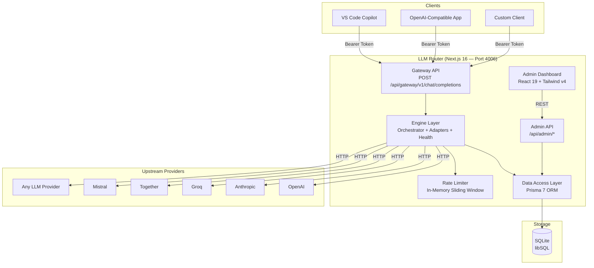
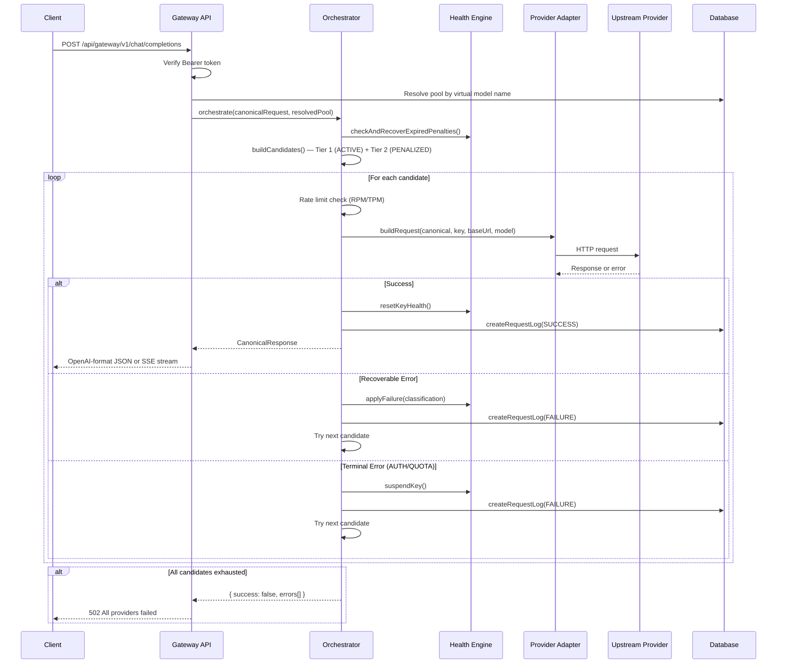

# Document 01 — System Overview & Architecture

> **Purpose**: High-level overview of the Local Multi-Provider LLM Router for research agents and stakeholders.  
> **Last Updated**: 2026-08-18

---

## 1. What Is This System?

The **Local Multi-Provider LLM Router** is a self-hosted, OpenAI-compatible API gateway that sits between your applications and multiple upstream LLM providers (OpenAI, Anthropic, Groq, Together, Mistral, etc.). It provides:

- **Unified Endpoint** — A single `POST /api/gateway/v1/chat/completions` endpoint that accepts OpenAI-format requests and routes them to the best available provider.
- **Automatic Failover** — If a provider key fails (rate-limited, quota exceeded, server error), the system automatically retries with the next available key/model combination.
- **Pool-Based Routing** — Virtual model names map to pools of real provider models, enabling load distribution and redundancy.
- **Health-Aware Key Management** — API keys are tracked with penalty states (active, penalized, suspended, disabled) and exponential backoff.
- **Admin Dashboard** — A full-featured web UI for managing providers, keys, models, pools, logs, usage analytics, and settings.

---

## 2. High-Level Architecture



---

## 3. Technology Stack

| Layer | Technology | Version | Role |
|---|---|---|---|
| **Framework** | Next.js (App Router) | 16.2.12 | Meta-framework — API routes, server components, routing |
| **UI Library** | React | 19.2.8 | Component-based UI |
| **Language** | TypeScript | 7.0.2 | Type-safe development |
| **Database** | SQLite via libSQL | @libsql/client 0.17.4 | Local-first, zero-config database |
| **ORM** | Prisma | 7.9.1 | Type-safe database access, migrations |
| **CSS** | Tailwind CSS | 4.3.3 | Utility-first styling (v4 with PostCSS plugin) |
| **UI Components** | Radix UI + shadcn/ui | Various | Accessible, unstyled primitives with Tailwind styling |
| **Authentication** | bcryptjs | 3.0.3 | Gateway key hashing (pure JS, no native dependencies) |
| **Icons** | Lucide React | 1.28.0 | Consistent icon set |
| **Encryption** | Node.js crypto (AES-256-GCM) | Built-in | API key encryption at rest |

---

## 4. Project Structure

```
Local-Multi-Provider-LLM-Router/
├── docs/                           # Documentation (this folder)
├── prisma/
│   └── schema.prisma               # Database schema (7 models)
├── bat/
│   └── start-router.bat            # Windows startup script
├── src/
│   ├── app/
│   │   ├── layout.tsx              # Root HTML shell
│   │   ├── page.tsx                # Redirects to /dashboard
│   │   ├── globals.css             # Tailwind + design tokens
│   │   ├── (admin)/                # Route group — admin pages
│   │   │   ├── layout.tsx          # Sidebar + content layout
│   │   │   ├── dashboard/          # Overview stats
│   │   │   ├── providers/          # Provider management
│   │   │   ├── pools/              # Pool management
│   │   │   ├── logs/               # Request log viewer
│   │   │   ├── usage/              # Usage analytics
│   │   │   └── settings/           # Gateway & penalty config
│   │   └── api/
│   │       ├── gateway/v1/chat/completions/  # Main LLM proxy endpoint
│   │       └── admin/              # REST API for all entities
│   │           ├── providers/      # Provider CRUD + keys + models
│   │           ├── pools/          # Pool CRUD
│   │           ├── keys/           # Key lifecycle actions
│   │           ├── models/         # Model CRUD
│   │           ├── logs/           # Log query + dashboard stats
│   │           ├── settings/       # Settings read/update
│   │           ├── usage/          # Usage aggregation
│   │           └── rate-limits/    # Live rate limit status
│   ├── components/
│   │   ├── layout/sidebar.tsx      # Navigation sidebar
│   │   ├── ui/                     # shadcn/ui primitives (9 components)
│   │   └── usage/                  # Usage page sub-components (5 files)
│   ├── engine/                     # Core routing engine
│   │   ├── orchestrator.ts         # Central failover routing logic
│   │   ├── canonical.ts            # Provider-agnostic type definitions
│   │   ├── error-classifier.ts     # Error taxonomy (7 categories)
│   │   ├── health-engine.ts        # Key penalty state machine
│   │   ├── response-normalizer.ts  # Ensure valid responses
│   │   ├── serializer.ts           # Canonical → OpenAI JSON/SSE
│   │   ├── adapters/               # Protocol-specific adapters
│   │   │   ├── chat-completions.ts # OpenAI / compatible
│   │   │   ├── messages.ts         # Anthropic Claude
│   │   │   └── responses.ts        # OpenAI Responses API
│   │   ├── data-access/            # Database CRUD operations
│   │   │   ├── providers.ts
│   │   │   ├── api-keys.ts
│   │   │   ├── models.ts
│   │   │   ├── pools.ts
│   │   │   ├── request-logs.ts
│   │   │   └── settings.ts
│   │   └── rate-limit/             # Rate limiting subsystem
│   │       ├── api-key-rate-limiter.ts
│   │       └── token-estimator.ts
│   └── lib/                        # Shared utilities
│       ├── prisma.ts               # Prisma client singleton
│       ├── encryption.ts           # AES-256-GCM encrypt/decrypt
│       ├── gateway-key.ts          # Gateway key generation/verification
│       ├── startup.ts              # Boot-time initialization
│       ├── api-key-rate-limits.ts  # Rate limit input parsing
│       └── utils.ts                # Tailwind cn() utility
├── package.json
├── next.config.ts
├── tsconfig.json
├── postcss.config.mjs
└── prisma.config.ts
```

---

## 5. Core Concepts

### 5.1 Providers

A **Provider** represents an upstream LLM service (e.g., OpenAI, Anthropic, Groq). Each provider has:
- A **base URL** (e.g., `https://api.openai.com/v1`)
- An **API format** that determines which adapter to use:
  - `CHAT_COMPLETIONS` — OpenAI-compatible (`/chat/completions`)
  - `MESSAGES` — Anthropic-style (`/messages`)
  - `RESPONSES` — OpenAI Responses API (`/responses`)
- One or more **API Keys** (encrypted at rest)
- One or more **Provider Models** (specific models like `gpt-4o`, `claude-3.5-sonnet`)

### 5.2 Pools

A **Pool** is a virtual routing abstraction that maps a **virtual model name** (what clients request) to one or more real provider models. Pools enable:
- **Redundancy** — Multiple providers backing the same virtual model
- **Load Distribution** — Via ROUND_ROBIN or PRIORITY routing strategies
- **Failover** — If one model/key fails, the next candidate is tried

### 5.3 API Keys & Health

Each provider API key has a lifecycle:
- **ACTIVE** — Healthy, available for routing
- **PENALIZED** — Temporarily deprioritized after failures (exponential backoff)
- **SUSPENDED** — Permanently excluded (quota/auth errors) until manual intervention
- **DISABLED** — Manually disabled by admin

### 5.4 Gateway Authentication

All gateway requests require a **Bearer token** (the "gateway key"). This is a single unified key generated on first boot, stored as a bcrypt hash. It is shown **once** in the console on first startup.

---

## 6. Request Flow Summary



---

## 7. Key Design Decisions

| Decision | Rationale |
|---|---|
| **SQLite + libSQL** | Zero-config, file-based database. Perfect for single-instance local deployment. Can be upgraded to Turso (remote libSQL) via env var. |
| **AES-256-GCM encryption** | API keys encrypted at rest with authenticated encryption. Fresh IV per encryption prevents nonce reuse. |
| **In-memory rate limiting** | No external dependencies (Redis). Per-key sliding window with promise-based serialization. Not distributed — suitable for single instance. |
| **Append-only logs** | Immutability ensures audit trail integrity. Relations use `SetNull` instead of cascade to preserve history. |
| **Canonical internal format** | Provider-agnostic types allow adapters to translate any protocol. Adding a new provider format only requires a new adapter. |
| **Exponential backoff penalties** | Automatic recovery from transient failures without manual intervention. Configurable base/multiplier/max via admin settings. |
| **Protected deletes** | Providers and models check for pool references before deletion, preventing broken routing configurations. |

---

## 8. Deployment

| Aspect | Details |
|---|---|
| **Default port** | 4006 |
| **Start command** | `npm start` (production) or `npm run dev` (development) |
| **Database** | Auto-created at `prisma/dev.db` on first run |
| **First boot** | Generates gateway key, displays it in console (copy immediately!) |
| **Startup script** | `bat/start-router.bat` (Windows) |

### Environment Variables

| Variable | Required | Default | Purpose |
|---|---|---|---|
| `ENCRYPTION_SECRET` | Yes | — | Secret for AES-256-GCM encryption of API keys |
| `DATABASE_URL` | No | `file:./dev.db` | SQLite/libSQL database path or Turso URL |

---

## 9. Current Feature Summary

| Feature | Status | Notes |
|---|---|---|
| OpenAI-compatible gateway | ✅ Implemented | `/api/gateway/v1/chat/completions` |
| Multi-provider support | ✅ Implemented | 3 API formats: Chat Completions, Messages, Responses |
| Pool-based routing | ✅ Implemented | ROUND_ROBIN and PRIORITY strategies |
| Direct model addressing | ✅ Implemented | `providerName/modelId` bypasses pools |
| Automatic failover | ✅ Implemented | Tier 1 → Tier 2 candidate loop |
| Health-aware key management | ✅ Implemented | Penalty state machine with exponential backoff |
| Rate limiting (RPM/TPM) | ✅ Implemented | Per-key, in-memory, sliding window |
| API key encryption | ✅ Implemented | AES-256-GCM at rest |
| Request logging | ✅ Implemented | Append-only with full metrics |
| Admin dashboard | ✅ Implemented | React 19 + Tailwind v4 |
| Usage analytics | ✅ Implemented | Token counts, request counts, filtering |
| Live rate limit charts | ✅ Implemented | Real-time RPM/TPM SVG charts |
| Streaming support | ✅ Implemented | SSE with synthetic terminal chunk guarantee |
| Tool/function calling | ✅ Implemented | Passed through to all supported providers |
| Vision support | ✅ Implemented | Model capability flag in schema |
