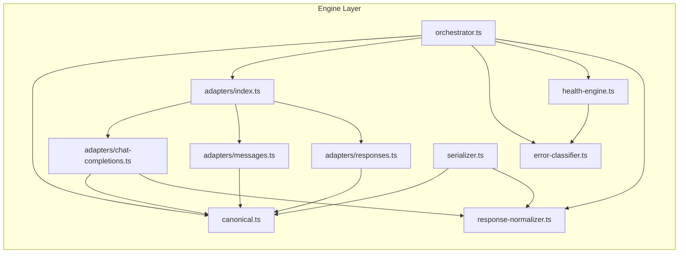
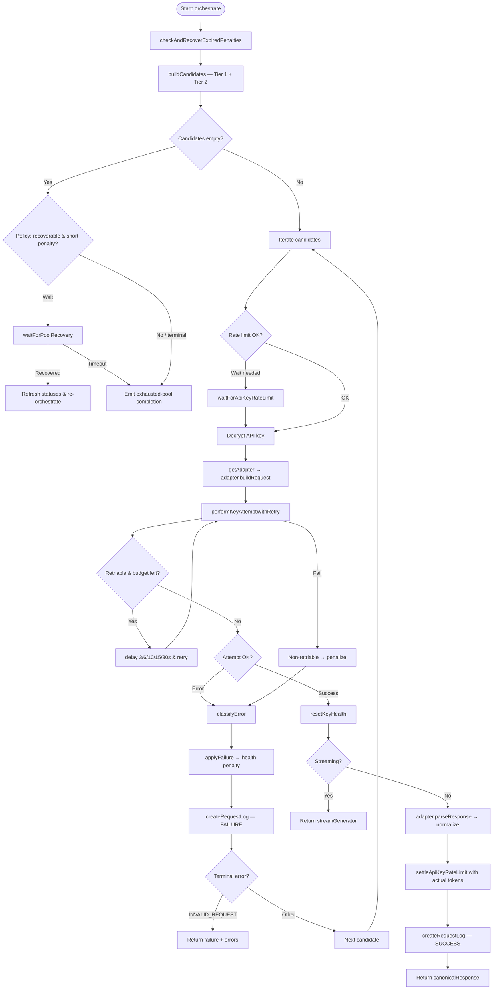
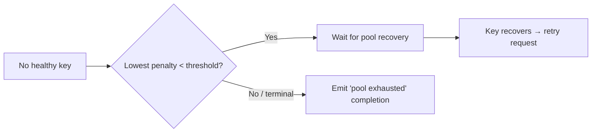
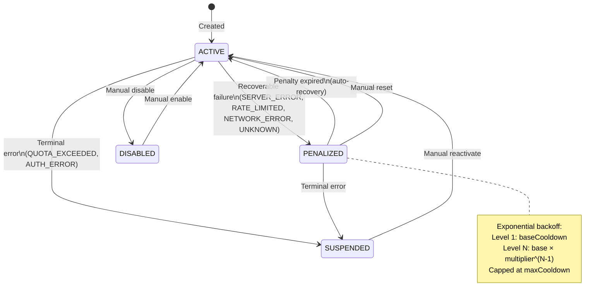

# Document 02 — Core Engine Architecture

> **Purpose**: Deep dive into the routing engine, adapters, health monitoring, and failover logic.  
> **Last Updated**: 2026-08-18

---

## 1. Engine Module Map

The engine layer is the heart of the router. It handles all request routing, provider communication, health tracking, and response normalization.



---

## 2. Canonical Types (`canonical.ts`)

The canonical module defines **provider-agnostic internal types** that every engine module operates on. This is the lingua franca — adapters translate provider-specific formats to/from these types.

### Request Types

| Type | Description |
|---|---|
| `MessageRole` | `"system" \| "user" \| "assistant" \| "tool"` |
| `TextContent` | `{ type: "text"; text: string }` |
| `ImageContent` | `{ type: "image_url"; image_url: { url: string; detail?: "low" \| "high" \| "auto" } }` |
| `ContentPart` | `TextContent \| ImageContent` |
| `CanonicalMessage` | `{ role, content: string \| ContentPart[], name?, tool_call_id? }` |
| `CanonicalTool` | `{ type: "function"; function: { name, description?, parameters } }` |
| `CanonicalRequest` | Full request: `model, messages, system?, temperature?, max_tokens?, top_p?, stream?, tools?, tool_choice?, stop?` |

### Response Types

| Type | Description |
|---|---|
| `CanonicalChoice` | `{ index, message: { role, content, tool_calls? }, finish_reason }` |
| `CanonicalUsage` | `{ prompt_tokens, completion_tokens, total_tokens }` |
| `CanonicalResponse` | `{ id, model, choices[], usage?, created }` |
| `CanonicalToolCall` | `{ id, type: "function", function: { name, arguments } }` |

### Streaming Types

| Type | Description |
|---|---|
| `CanonicalDeltaChoice` | `{ index, delta: { role?, content?, tool_calls? }, finish_reason? }` |
| `CanonicalDelta` | `{ id?, model?, choices[], usage? }` |

### ProviderAdapter Interface

Every adapter must implement this contract:

```typescript
interface ProviderAdapter {
  buildRequest(canonical: CanonicalRequest, apiKey: string, baseUrl: string, modelId: string): {
    url: string;
    headers: Record<string, string>;
    body: string;
  };

  parseResponse(responseBody: string, statusCode: number): CanonicalResponse;
  parseStreamChunk(chunk: string): CanonicalDelta | null;
  parseError(responseBody: string, statusCode: number): {
    httpStatus: number;
    providerErrorMessage: string;
    providerErrorCode: string | null;
  };
}
```

### Helper Functions

| Function | Purpose |
|---|---|
| `normalizeContent(content)` | Collapses `ContentPart[]` to a plain string (text parts joined by `\n`) |
| `contentToParts(content)` | Wraps a plain string into `[{ type: "text", text }]` |

---

## 3. Adapter System (`adapters/`)

### Adapter Registry (`adapters/index.ts`)

A static registry mapping `apiFormat` strings to adapter instances:

| apiFormat String | Adapter | Target Providers |
|---|---|---|
| `CHAT_COMPLETIONS` | `chatCompletionsAdapter` | OpenAI, Groq, Together, Mistral, any OpenAI-compatible |
| `MESSAGES` | `messagesAdapter` | Anthropic Claude |
| `RESPONSES` | `responsesAdapter` | OpenAI Responses API |

`getAdapter(apiFormat: string): ProviderAdapter` — throws if unknown format.

### 3.1 Chat Completions Adapter

**Targets**: OpenAI and all OpenAI-compatible endpoints.

| Method | Behavior |
|---|---|
| `buildRequest` | URL: `{baseUrl}/chat/completions`. Maps canonical messages directly. Sets `stream_options: { include_usage: true }` for streaming. Auth: `Bearer` token. |
| `parseResponse` | Maps `raw.choices[]` → `CanonicalChoice[]`. Runs through `normalizeCanonicalResponse`. Generates fallback IDs with `"chatcmpl-"` prefix. |
| `parseStreamChunk` | Parses `data: {...}` SSE lines. Skips `[DONE]` and empty-choice chunks. Returns `null` for unparseable lines. |
| `parseError` | Tries `raw.error.message`, falls back to `raw.message`, then `HTTP {statusCode}`. |

**Key detail**: `stream_options: { include_usage: true }` is always set for streaming, ensuring the final chunk includes token usage counts.

### 3.2 Messages Adapter (Anthropic)

**Targets**: Anthropic Claude API.

| Method | Behavior |
|---|---|
| `buildRequest` | URL: `{baseUrl}/messages`. Extracts system messages into `body.system` (joined by `\n`). Maps content to Anthropic content blocks: text → `{ type: "text", text }`, images → `{ type: "image", source: { type: "url", url } }`. Maps tools to `{ name, description, input_schema }`. Auth: `x-api-key` header + `anthropic-version: 2023-06-01`. Default `max_tokens = 4096`. |
| `parseResponse` | Iterates `raw.content[]` blocks. Maps `stop_reason`: `end_turn→stop`, `max_tokens→length`, `tool_use→tool_calls`, `stop_sequence→stop`. Maps usage: `input_tokens→prompt_tokens`, `output_tokens→completion_tokens`. |
| `parseStreamChunk` | Handles Anthropic's event-based SSE. Processes: `content_block_start` (tool_use), `content_block_delta` (text/input_json), `message_delta` (finish + usage), `message_start` (id + model). Ignores `ping` events. |
| `parseError` | Standard pattern: `raw.error.message` → fallback chain. |

**Anthropic-specific details**:
- System prompt is a top-level field, not a message
- Content is always an array of typed blocks
- Streaming uses `event:` / `data:` line pairs
- Tool use arrives via `content_block_start` then incremental `input_json_delta`

### 3.3 Responses Adapter (OpenAI Responses API)

**Targets**: OpenAI's newer Responses API.

| Method | Behavior |
|---|---|
| `buildRequest` | URL: `{baseUrl}/responses`. Uses `input` instead of `messages`. Auth: `Bearer` token. |
| `parseResponse` | Iterates `raw.output[]` items. `message` items with `output_text` → text. `function_call` items → tool calls (using `call_id`, `name`, `arguments`). Maps `status`: `stop→stop`, `length→length`. |
| `parseStreamChunk` | Handles event-driven SSE. Events: `response.output_text.delta`, `response.function_call_arguments.delta`, `response.function_call_arguments.done`, `response.completed`/`response.done`, `response.created`. |
| `parseError` | Standard pattern. |

**Key difference**: Uses `output[]` instead of `choices[]`, and `input` instead of `messages`.

---

## 4. Orchestrator (`orchestrator.ts`)

The orchestrator is the **central routing engine**. It takes a `CanonicalRequest` + a `ResolvedPool` and iterates through candidate keys until success or exhaustion.

### Key Data Structures

```typescript
interface CandidateKey {
  apiKeyId: string;
  apiKeyLabel: string;
  secretEncrypted: string;
  status: string;
  penaltyLevel: number;
  penaltyExpiresAt: Date | null;
  lastUsedAt: Date | null;
  rpmLimit: number | null;
  tpmLimit: number | null;
}

interface CandidateMember {
  memberId: string;
  priority: number;
  providerModelId: string;
  providerModelName: string;
  displayName: string;
  providerId: string;
  providerName: string;
  baseUrl: string;
  apiFormat: string;
  keys: CandidateKey[];
}

interface ResolvedPool {
  id: string;
  name: string;
  routingStrategy: string;
  cacheAware: boolean;
  stickyContextTokenBudget: number;
  members: CandidateMember[];
  /** Optional override for the `poolId` written to RequestLog rows. The public
   *  gateway leaves it unset (defaults to `resolvedPool.id`, a real Pool).
   *  Ad-hoc single-model calls that build a synthetic pool (e.g. the admin
   *  Chat page) pass `null` so usage is still recorded without a Pool FK. */
  logPoolId?: string | null;
}

interface OrchestratorResult {
  success: boolean;
  canonicalResponse?: CanonicalResponse;
  streamGenerator?: AsyncGenerator<CanonicalDelta>;
  errors: AttemptError[];
}
```

### Candidate List Builder (`buildCandidates`)

Filters and sorts keys into two tiers:

| Tier | Keys | Priority |
|---|---|---|
| **Tier 1** | `ACTIVE` keys | Tried first |
| **Tier 2** | `PENALIZED` keys | Tried as fallback |
| **Skipped** | `DISABLED`, `SUSPENDED` | Never tried |

**Sorting strategies** (honored by the orchestrator via `routing/strategies.ts`):
- **`KEY_AWARE`** (default): Caching-aware selector (`routing/selector.ts`) — orders by conversation affinity (cache stickiness), exhaustability, context-fit, rotation-cost and speed.
- **`PRIORITY`**: Sort by `member.priority` ascending (lower = higher), then `lastUsedAt` ascending (LRU tiebreaker)
- **`ROUND_ROBIN`**: Sort purely by `lastUsedAt` ascending (LRU first)
- **Tier 2 always**: Sorted by `penaltyExpiresAt` ascending (soonest-to-expire first)

> **Note**: `routing/strategies.ts` provides `orderByStrategy()` + `isSimpleStrategy()`. The orchestrator routes `ROUND_ROBIN`/`PRIORITY` through the simple deterministic ordering and `KEY_AWARE` through the caching-aware selector. Previously the strategy was stored/displayed but never actually applied to routing — this was fixed during the pools audit.

### Main Orchestration Flow



### Streaming Helper (`streamResponse`)

An `async function*` generator that:

1. Reads chunks from `response.body` via `ReadableStream` reader
2. Buffers incomplete lines, splits on `\n`
3. Passes each line to `adapter.parseStreamChunk()`
4. Yields `CanonicalDelta` objects
5. Tracks `deltaCount`, `skippedEmptyChoices`, `sawTerminal`
6. Captures `usage` from the last chunk that includes it
7. **Injects synthetic terminal chunk** if provider never emitted `finish_reason` (safety net)
8. In `finally` block: releases reader lock, settles rate-limit reservation, creates success log

**Stream guarantee**: Both routing modes inject a synthetic terminal chunk with `finish_reason: "stop"` + `[DONE]` even if the upstream stream errors mid-generation.

---

## 5. Error Classification (`error-classifier.ts`)

Maps HTTP status codes + provider error details to a fixed taxonomy.

### Error Categories

| Classification | HTTP Status | Condition |
|---|---|---|
| `NETWORK_ERROR` | 0 | Connection failure |
| `QUOTA_EXCEEDED` | 402, 403 | Billing/payment issues |
| `QUOTA_EXCEEDED` | 429 | Body contains quota keywords* |
| `RATE_LIMITED` | 429 | Temporary rate limit, or any 4xx whose body mentions rate/limit wording |
| `SERVER_ERROR` | 500-599, 408, 409, 425 | Upstream server / transient error |
| `AUTH_ERROR` | 401 | Invalid credentials |
| `INVALID_REQUEST` | 400, 404 | Malformed request / model-path not found |
| `UNKNOWN` | Other | Catch-all (treated as retriable downstream) |

*Quota keywords: `"quota"`, `"billing"`, `"insufficient"`, `"balance"`, `"payment"`, `"exceeded"`, `"limit reached"`

> **Task 03 (logs detail)** — `classifyError` now maps otherwise-ambiguous real-world statuses
> (408, 409, 425, and any 4xx with rate-limit wording) to meaningful categories instead of
> collapsing them into `UNKNOWN`. The original provider message + code are always carried
> through to the `RequestLog` so the /logs page can display exactly what happened.

---

## 5b. Exhausted-Pool Policy (`routing/exhausted-pool-policy.ts`)

When a pool has **no routable (healthy) key**, the orchestrator must choose between two
behaviors for an autonomous agent:

1. **Wait** — hold the request in the queue until a key's penalty expires and it flips back
   to `ACTIVE`, then retry. The agent simply waits; it sees no error ever.
2. **Emit** — return the pre-defined "pool exhausted" assistant completion so the agent
   **stops** (a hard error or a hang would waste its turn).

The decision is governed by the **lowest pending penalty** across the pool:

- If the shortest remaining penalty is **under** `EXHAUSTED_MIN_PENALTY_SECONDS`
  (default **30 min / 1800s**), the request **stays queued** and the pool-recovery wait
  holds it until a key is healthy again.
- If **every** pending penalty is **over** the threshold — or nothing is time-bound
  (suspended/disabled keys only) — the gateway **emits** the exhausted completion so the
  agent stops instead of hanging.



---

## 5c. Silent Server-Error Retry (`routing/retry-backoff.ts`, `routing/attempt.ts`)

Transient, non-limit errors — `SERVER_ERROR`, `NETWORK_ERROR`, and `UNKNOWN` — are **not**
penalized immediately. Instead the orchestrator silently retries the **same key** with an
increasing backoff, so an autonomous agent never sees a spurious failure:

| Failure | Wait before next retry |
|---|---|
| initial | 3s |
| 1st retry | 6s |
| 2nd retry | 10s |
| 3rd retry | 15s |
| 4th retry | 30s |
| 5th retry | → apply Level-1 penalty |

- Rate limits, quota, auth errors, and invalid requests are **never** silently retried —
  they go straight to the penalty / rejection path (they have their own semantics).
- Only after the **5-retry budget** is exhausted does the orchestrator apply a **Level-1
  penalty** (via `applyFailure`) and move on to the next candidate.

---

## 6. Health Engine (`health-engine.ts`)

Implements a **penalty/suspension state machine** for API keys with exponential backoff and automatic recovery.

### Key Statuses

| Status | Meaning | Tier |
|---|---|---|
| `ACTIVE` | Healthy, available | Tier 1 |
| `PENALIZED` | Temporarily deprioritized | Tier 2 |
| `SUSPENDED` | Permanently excluded (manual reactivate) | Excluded |
| `DISABLED` | Manually disabled by admin | Excluded |

### State Machine



### Penalty Escalation (`applyFailure`)

For **recoverable errors** (SERVER_ERROR, RATE_LIMITED, NETWORK_ERROR, UNKNOWN):

1. No prior penalty or reset window expired → **Level 1**, cooldown = `baseCooldown` (default 600s = 10min)
2. Otherwise → increment level, cooldown = `baseCooldown × multiplier^(level-1)`, capped at `maxCooldown` (default 21600s = 6hr)
3. Key status → `PENALIZED`, `penaltyExpiresAt` set

For **terminal errors**:
- `QUOTA_EXCEEDED` → `SUSPENDED` with reason `"quota_exceeded"`
- `AUTH_ERROR` → `SUSPENDED` with reason `"invalid_credentials"`

For `INVALID_REQUEST` → No penalty (client error, not provider's fault).

### Recovery

`checkAndRecoverExpiredPenalties()` — Bulk-updates all `PENALIZED` keys whose `penaltyExpiresAt <= now` back to `ACTIVE`. Called at the start of each orchestration run.

### Administrative Functions

| Function | Effect |
|---|---|
| `suspendKey(apiKeyId, reason)` | Manual suspension |
| `reactivateKey(apiKeyId)` | Full reset to ACTIVE |
| `disableKey(apiKeyId)` | Manual disable |
| `enableKey(apiKeyId)` | Re-enable from disabled |
| `resetPenalty(apiKeyId)` | Clear penalty state |
| `resetKeyHealth(apiKeyId)` | Reset consecutiveFailures, update lastUsedAt |

---

## 7. Response Normalization (`response-normalizer.ts`)

Ensures every `CanonicalResponse` has **at least one choice**. Some providers return empty `choices[]` in edge cases.

```typescript
function normalizeCanonicalResponse(response: CanonicalResponse): CanonicalResponse {
  if (response.choices.length > 0) return response;
  return {
    ...response,
    choices: [{
      index: 0,
      message: { role: "assistant", content: "" },
      finish_reason: "stop",
    }],
  };
}
```

Called by:
- The orchestrator after `adapter.parseResponse()` for non-streaming responses
- `chatCompletionsAdapter.parseResponse()` internally (defensive)
- `serializeResponse()` before output

---

## 8. Serializer (`serializer.ts`)

Converts canonical internal types back to **OpenAI-compatible JSON/SSE format**. The client always sees the OpenAI chat completions wire format regardless of which provider served the request.

| Function | Output |
|---|---|
| `serializeResponse(canonical)` | OpenAI `chat.completion` JSON object |
| `serializeDelta(delta)` | SSE line: `data: {"id":"...","object":"chat.completion.chunk",...}\n\n` |
| `serializeStreamEnd()` | `data: [DONE]\n\n` |

**Key behaviors**:
- `serializeResponse` conditionally includes `tool_calls` only when present and non-empty
- `serializeDelta` skips deltas with empty `choices[]` (returns `""`)
- `serializeDelta` ensures `delta` field is always `{}` even if provider omitted it

---

## 9. Rate Limiting Subsystem

### Token Estimator (`rate-limit/token-estimator.ts`)

Pre-request token estimation for rate limiting:
- `CHARS_PER_TOKEN_APPROX = 4`
- Counts characters in system prompt + messages + tools + tool_choice + stop sequences
- Text content: character count; non-text content: 800 chars fixed estimate
- Completion budget: `max_tokens` if set, else clamped between 256–1024
- Returns `promptTokens + completionBudget`

### Rate Limiter (`rate-limit/api-key-rate-limiter.ts`)

A **per-key, sliding-window, in-memory** rate limiter with reservation-based token accounting.

**Constants**: `WINDOW_MS = 60,000` (1-minute sliding window)

**Data structures**:
```
Map<apiKeyId, KeyWindowState>
  ├── requestTimestamps: number[]     (RPM tracking)
  ├── tokenRecords: TokenRecord[]     (TPM tracking)
  └── tail: Promise<void>             (serialization chain)
```

**Core functions**:

| Function | Purpose |
|---|---|
| `waitForApiKeyRateLimit(input)` | Main entry. Returns reservation once key is within RPM + TPM limits. |
| `settleApiKeyRateLimit(reservation, actualTokens?)` | Post-request. Replaces estimated tokens with actual. |
| `getAllKeyRateSnapshots()` | Live RPM/TPM for all keys (dashboard). |
| `getKeyRateSnapshot(apiKeyId)` | Single-key snapshot. |

**Algorithm**:
1. Prune expired entries older than 60s
2. RPM check: if `timestamps.length >= rpmLimit`, wait until oldest expires
3. TPM check: if `sum(tokens) + requested > tpmLimit`, wait until enough expire
4. Wait `max(rpmWait, tpmWait)` ms
5. Reserve: push timestamp + token record
6. Settle: after response, replace estimated with actual

**Serialization**: Each key's operations are serialized via a promise chain (`state.tail`) to prevent race conditions.
