# Document 03 — API Gateway & Protocol Reference

> **Purpose**: Complete reference for all API endpoints, request/response formats, and protocol handling.  
> **Last Updated**: 2026-08-18

---

## 1. API Architecture Overview

```mermaid
graph TB
    subgraph "Public API"
        GW["POST /api/gateway/v1/chat/completions<br/>🔑 Bearer Token Required"]
    end

    subgraph "Admin API (No Auth)"
        PROV["/api/admin/providers<br/>GET · POST"]
        PROV_ID["/api/admin/providers/[id]<br/>GET · PUT · DELETE"]
        PROV_KEYS["/api/admin/providers/[id]/keys<br/>GET · POST"]
        PROV_MODS["/api/admin/providers/[id]/models<br/>GET · POST"]
        KEY_ID["/api/admin/keys/[id]<br/>PUT · DELETE · PATCH"]
        MOD_ID["/api/admin/models/[id]<br/>PUT · DELETE"]
        POOL["/api/admin/pools<br/>GET · POST"]
        POOL_ID["/api/admin/pools/[id]<br/>GET · PUT · DELETE"]
        LOGS["/api/admin/logs<br/>GET"]
        SETTINGS["/api/admin/settings<br/>GET · PUT"]
        USAGE["/api/admin/usage<br/>GET"]
        RL["/api/admin/rate-limits/status<br/>GET"]
    end

    GW -->|Routes to| ENGINE[Engine Layer]
    PROV --> DA[Data Access]
    PROV_ID --> DA
    PROV_KEYS --> DA
    PROV_MODS --> DA
    KEY_ID --> DA
    MOD_ID --> DA
    POOL --> DA
    POOL_ID --> DA
    LOGS --> DA
    SETTINGS --> DA
    USAGE --> DA
    RL --> RL_ENGINE[Rate Limiter]
```



---

## 2. Gateway API

### `POST /api/gateway/v1/chat/completions`

The core LLM proxy endpoint. Fully OpenAI-compatible.

| Property | Details |
|---|---|
| **Auth** | `Authorization: Bearer <gateway-key>` — verified via bcrypt hash |
| **Max Duration** | 300 seconds (5 min for long streaming) |
| **Runtime** | Node.js, force-dynamic, no fetch-cache |

#### Request Body

```json
{
  "model": "string (required)",
  "messages": [{ "role": "user", "content": "Hello" }],
  "stream": false,
  "temperature": 0.7,
  "max_tokens": 1024,
  "top_p": 1.0,
  "tools": [{ "type": "function", "function": { "name": "...", "parameters": {} } }],
  "tool_choice": "auto",
  "stop": ["\n"]
}
```

| Field | Type | Required | Notes |
|---|---|---|---|
| `model` | string | Yes | Virtual model name (pool) OR `providerName/modelId` (direct) |
| `messages` | array | Yes | Chat messages with `role` and `content` |
| `stream` | boolean | No | Default `false`. Enables SSE streaming |
| `temperature` | number | No | Sampling temperature |
| `max_tokens` / `max_completion_tokens` | number | No | Max tokens to generate |
| `top_p` | number | No | Nucleus sampling |
| `tools` | array | No | Function/tool definitions |
| `tool_choice` | string/object | No | `"auto"`, `"none"`, `"required"`, or specific function |
| `stop` | string/array | No | Stop sequences |

#### Routing Modes

**Mode 1 — Pool-based** (model matches a Pool's `virtualModelName`):
- Resolves pool with all members, providers, and API keys
- Calls `orchestrate()` — failover loop through Tier 1 → Tier 2 candidates
- Supports ROUND_ROBIN and PRIORITY strategies

**Mode 2 — Direct addressing** (model format: `providerName/modelId`):
- Looks up provider by name, finds matching model
- Uses first active API key (not DISABLED/SUSPENDED)
- Bypasses orchestrator (single attempt only)

#### Response Formats

**Non-streaming success** (200):
```json
{
  "id": "chatcmpl-abc123",
  "object": "chat.completion",
  "created": 1699999999,
  "model": "gpt-4o",
  "choices": [{
    "index": 0,
    "message": { "role": "assistant", "content": "Hello!" },
    "finish_reason": "stop"
  }],
  "usage": {
    "prompt_tokens": 10,
    "completion_tokens": 5,
    "total_tokens": 15
  }
}
```

**Streaming** (200, `text/event-stream`):
```
data: {"id":"chatcmpl-abc123","object":"chat.completion.chunk","choices":[{"index":0,"delta":{"content":"Hello"},"finish_reason":null}]}

data: {"id":"chatcmpl-abc123","object":"chat.completion.chunk","choices":[{"index":0,"delta":{},"finish_reason":"stop"}],"usage":{"prompt_tokens":10,"completion_tokens":5,"total_tokens":15}}

data: [DONE]
```

**Error responses**:

| Status | Type | Condition |
|---|---|---|
| 400 | `invalid_request` | Missing model or messages |
| 401 | `auth_error` | Invalid or missing gateway key |
| 404 | `not_found` | Model/pool not found, no active keys |
| 502 | `all_failed` | All candidates exhausted |
| 502 | `network_error` | All candidates had network errors |
| 500 | `internal_error` | Unexpected server error |

```json
{
  "error": {
    "message": "All providers failed. Errors: ...",
    "type": "all_failed"
  }
}
```

---

## 3. Admin API — Providers

### `GET /api/admin/providers`

Returns all providers with key/model counts.

**Response**: `200 OK`
```json
[
  {
    "id": "clx...",
    "name": "OpenAI",
    "baseUrl": "https://api.openai.com/v1",
    "apiFormat": "CHAT_COMPLETIONS",
    "notes": "Main OpenAI account",
    "_count": { "apiKeys": 2, "providerModels": 5 }
  }
]
```

### `POST /api/admin/providers`

Create a new provider.

**Request body**:
```json
{
  "name": "OpenAI (required)",
  "baseUrl": "https://api.openai.com/v1 (required)",
  "apiFormat": "CHAT_COMPLETIONS | MESSAGES | RESPONSES (required)",
  "notes": "Optional notes"
}
```

**Response**: `201 Created` — provider object

### `GET /api/admin/providers/[id]`

Returns provider with nested `apiKeys[]` and `providerModels[]`.

**Response**: `200 OK` or `404 Not Found`

### `PUT /api/admin/providers/[id]`

Partial update provider fields.

**Request body**: `{ name?, baseUrl?, apiFormat?, notes? }`

### `DELETE /api/admin/providers/[id]`

Delete provider. **Blocked** if any of its models are referenced by pool members.

**Response**: `200 { success: true }` or `400` with blocking pool details

---

## 4. Admin API — Provider Keys

### `GET /api/admin/providers/[id]/keys`

Returns all API keys for a provider.

### `POST /api/admin/providers/[id]/keys`

Create a new API key. Secret is **encrypted** before storage.

**Request body**:
```json
{
  "label": "My OpenAI Key (required)",
  "secret": "sk-... (required)",
  "rpmLimit": 100,
  "tpmLimit": 100000
}
```

Rate limit fields: positive integer, `"unlimited"`, `"infinity"`, `""`, or `null` = no limit.

### `PUT /api/admin/keys/[id]`

Update key label, secret, or rate limits. Re-encrypts if secret changes.

### `DELETE /api/admin/keys/[id]`

Delete key. Logs preserve history via `SetNull`.

### `PATCH /api/admin/keys/[id]`

Lifecycle actions on a key.

**Request body**: `{ "action": "disable" | "enable" | "reactivate" | "reset-penalty" }`

| Action | Effect |
|---|---|
| `disable` | Sets `manuallyDisabled: true`, status → DISABLED |
| `enable` | Clears manual disable, status → ACTIVE |
| `reactivate` | Clears suspension, re-enables a SUSPENDED key |
| `reset-penalty` | Zeroes penalty level and expiry |

---

## 5. Admin API — Provider Models

### `GET /api/admin/providers/[id]/models`

Returns all models for a provider.

### `POST /api/admin/providers/[id]/models`

Create a new model.

**Request body**:
```json
{
  "modelId": "gpt-4o (required)",
  "displayName": "GPT-4o (required)",
  "supportsVision": true,
  "supportsFunctionCalling": true,
  "contextWindow": 128000
}
```

### `PUT /api/admin/models/[id]`

Update model fields. Can toggle `enabled`.

### `DELETE /api/admin/models/[id]`

Delete model. **Blocked** if referenced by pool members.

---

## 6. Admin API — Pools

### `GET /api/admin/pools`

Returns all pools with member counts and health stats.

**Response**:
```json
[
  {
    "id": "clx...",
    "name": "GPT-4 Pool",
    "virtualModelName": "gpt-4",
    "routingStrategy": "PRIORITY",
    "poolMembers": [...],
    "_count": { "poolMembers": 3 },
    "healthyKeys": 5,
    "totalKeys": 6
  }
]
```

### `POST /api/admin/pools`

Two creation modes:

**Quick mode**:
```json
{
  "quickMode": true,
  "providerModelId": "clx...",
  "virtualModelName": "gpt-4"
}
```

**Full mode**:
```json
{
  "name": "GPT-4 Pool (required)",
  "virtualModelName": "gpt-4 (required)",
  "description": "Redundant GPT-4 access",
  "routingStrategy": "PRIORITY | ROUND_ROBIN",
  "members": [
    { "providerModelId": "clx...", "priority": 0 },
    { "providerModelId": "cly...", "priority": 1 }
  ]
}
```

### `GET /api/admin/pools/[id]`

Returns pool with full nested member → model → provider → keys tree.

### `PUT /api/admin/pools/[id]`

Update pool config and members. Members are **replaced atomically** (delete all + create new).

### `DELETE /api/admin/pools/[id]`

Delete pool and all members.

---

## 7. Admin API — Logs

### `GET /api/admin/logs`

Two modes controlled by query parameters:

**Dashboard stats mode** (`?stats=true`):
```json
{
  "providerCount": 3,
  "keyCount": 8,
  "poolCount": 5,
  "healthyKeys": 6,
  "penalizedKeys": 1,
  "suspendedKeys": 1,
  "disabledKeys": 0,
  "requestsToday": 1234,
  "failuresToday": 12,
  "failureRate": "0.97",
  "recentFailures": [...]
}
```

**Log query mode** (default):

| Param | Type | Description |
|---|---|---|
| `providerId` | string | Filter by provider |
| `poolId` | string | Filter by pool |
| `apiKeyId` | string | Filter by key |
| `outcome` | string | `SUCCESS` or `FAILURE` |
| `errorClassification` | string | Error type filter |
| `dateFrom` | ISO date | Start of range |
| `dateTo` | ISO date | End of range |
| `page` | number | Default: 1 |
| `pageSize` | number | Default: 50 |

**Response**:
```json
{
  "logs": [{ "id", "outcome", "errorClassification", "httpStatus", "latencyMs", "promptTokens", "completionTokens", "requestedVirtualModel", "tier", "createdAt", "apiKey": {...}, "pool": {...}, "providerModel": {...} }],
  "total": 500,
  "page": 1,
  "pageSize": 50,
  "totalPages": 10
}
```

---

## 8. Admin API — Settings

### `GET /api/admin/settings`

```json
{
  "gatewayKeyPrefix": "sk-abc...xyz",
  "penaltyBaseCooldownSeconds": 600,
  "penaltyMultiplier": 3,
  "penaltyMaxCooldownSeconds": 21600,
  "penaltyResetWindowSeconds": 3600
}
```

### `PUT /api/admin/settings`

**Regenerate gateway key**:
```json
{ "action": "regenerate-key" }
```
Response includes `plaintextKey` (shown once, cannot be retrieved again).

**Update penalty settings**:
```json
{
  "penaltyBaseCooldownSeconds": 600,
  "penaltyMultiplier": 3,
  "penaltyMaxCooldownSeconds": 21600,
  "penaltyResetWindowSeconds": 3600
}
```

---

## 9. Admin API — Usage

### `GET /api/admin/usage`

| Param | Type | Description |
|---|---|---|
| `dateFrom` | ISO date | Start of range |
| `dateTo` | ISO date | End of range |
| `providerId` | string | Filter by provider |
| `poolId` | string | Filter by pool |
| `apiKeyId` | string | Filter by key |

**Response**:
```json
{
  "promptTokens": 50000,
  "completionTokens": 30000,
  "totalTokens": 80000,
  "requestCount": 500,
  "successCount": 490,
  "failureCount": 10
}
```

---

## 10. Admin API — Rate Limit Status

### `GET /api/admin/rate-limits/status`

Three modes:

| Mode | Params | Description |
|---|---|---|
| Single key | `?apiKeyId=<id>` | Live snapshot for one key |
| Pool | `?poolId=<id>` | All keys in a pool |
| Global | (none) | All keys with limits or traffic |

**Response**:
```json
[
  {
    "apiKeyId": "clx...",
    "apiKeyLabel": "My Key",
    "providerName": "OpenAI",
    "rpmCurrent": 42,
    "rpmLimit": 100,
    "tpmCurrent": 15000,
    "tpmLimit": 100000,
    "isWaiting": false,
    "waitingCount": 0
  }
]
```

---

## 11. Protocol Support Matrix

| Protocol | Adapter | Providers | Auth Header | System Prompt | Content Format | Streaming Format |
|---|---|---|---|---|---|---|
| Chat Completions | `chatCompletionsAdapter` | OpenAI, Groq, Together, Mistral | `Authorization: Bearer` | Message with `role: "system"` | String or content parts | `data: {...}\n\n` |
| Messages | `messagesAdapter` | Anthropic Claude | `x-api-key` + `anthropic-version` | Top-level `system` field | Array of typed blocks | `event:` / `data:` pairs |
| Responses | `responsesAdapter` | OpenAI Responses API | `Authorization: Bearer` | Via `input` | String or parts array | Event-driven with `type` field |
