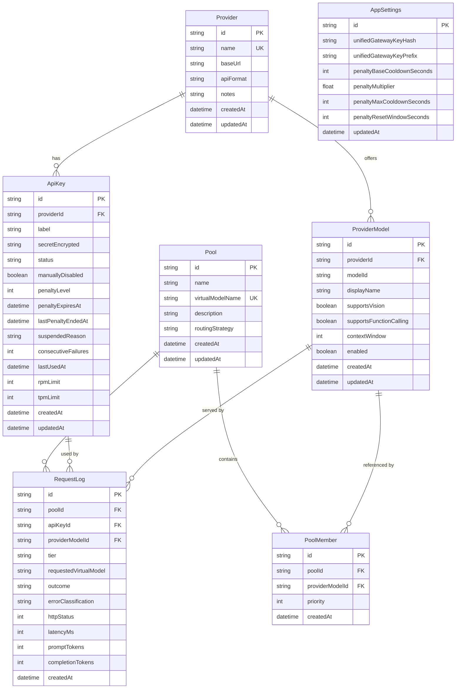
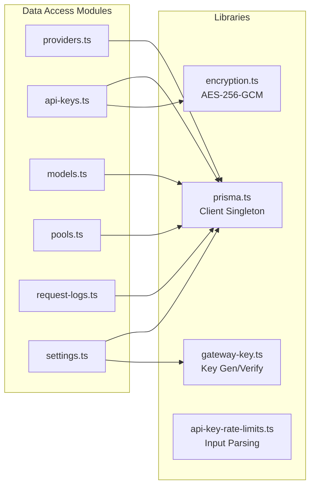
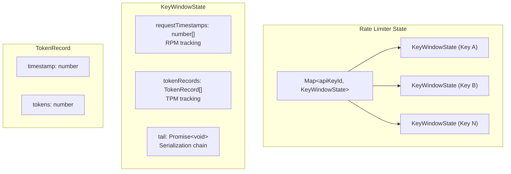
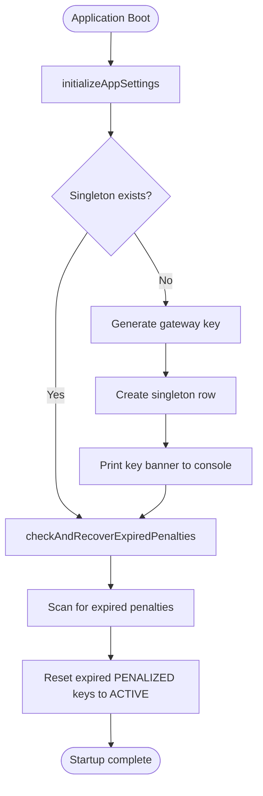

# Document 04 — Data Layer & Database Schema

> **Purpose**: Complete reference for the database schema, data access patterns, encryption, rate limiting, and storage design.  
> **Last Updated**: 2026-08-18

---

## 1. Database Overview

| Aspect | Details |
|---|---|
| **Engine** | SQLite via libSQL (`@prisma/adapter-libsql` + `@libsql/client`) |
| **ORM** | Prisma 7.9.1 |
| **Default URL** | `file:./dev.db` (local SQLite file) |
| **Override** | `DATABASE_URL` env var (supports Turso remote URLs) |
| **Schema location** | `prisma/schema.prisma` |

---

## 2. Entity-Relationship Diagram



---

## 3. Model Details

### 3.1 Provider

Represents an upstream LLM service.

| Field | Type | Constraints | Purpose |
|---|---|---|---|
| `id` | string (cuid) | PK | Unique identifier |
| `name` | string | Unique | Provider display name |
| `baseUrl` | string | Required | API base URL (e.g., `https://api.openai.com/v1`) |
| `apiFormat` | string | Required | Protocol: `CHAT_COMPLETIONS`, `MESSAGES`, or `RESPONSES` |
| `notes` | string | Optional | Admin notes |
| `createdAt` | datetime | Auto | Creation timestamp |
| `updatedAt` | datetime | Auto | Last update timestamp |

**Relations**: Has many `ApiKey`, has many `ProviderModel`

**Cascade**: Deleting a provider cascades to all its keys and models.

### 3.2 ApiKey

An encrypted API key belonging to a provider.

| Field | Type | Constraints | Purpose |
|---|---|---|---|
| `id` | string (cuid) | PK | Unique identifier |
| `providerId` | string | FK → Provider | Owning provider |
| `label` | string | Required | Human-friendly label |
| `secretEncrypted` | string | Required | AES-256-GCM encrypted secret |
| `status` | string | Default: `"ACTIVE"` | Lifecycle state |
| `manuallyDisabled` | boolean | Default: `false` | Admin override flag |
| `penaltyLevel` | int | Default: `0` | Exponential backoff level |
| `penaltyExpiresAt` | datetime | Nullable | When current penalty expires |
| `lastPenaltyEndedAt` | datetime | Nullable | For penalty reset window tracking |
| `suspendedReason` | string | Nullable | Why key was suspended |
| `consecutiveFailures` | int | Default: `0` | Failure counter |
| `lastUsedAt` | datetime | Nullable | Last request timestamp |
| `rpmLimit` | int | Nullable | Requests per minute cap (null = unlimited) |
| `tpmLimit` | int | Nullable | Tokens per minute cap (null = unlimited) |
| `createdAt` | datetime | Auto | Creation timestamp |
| `updatedAt` | datetime | Auto | Last update timestamp |

**Status values**: `ACTIVE`, `DISABLED`, `PENALIZED`, `SUSPENDED`

### 3.3 ProviderModel

A specific model offered by a provider.

| Field | Type | Constraints | Purpose |
|---|---|---|---|
| `id` | string (cuid) | PK | Unique identifier |
| `providerId` | string | FK → Provider | Owning provider |
| `modelId` | string | Required | Actual model ID at provider (e.g., `gpt-4o`) |
| `displayName` | string | Required | Human-friendly name |
| `supportsVision` | boolean | Default: `false` | Image input capability |
| `supportsFunctionCalling` | boolean | Default: `false` | Tool/function calling |
| `contextWindow` | int | Nullable | Context window size in tokens |
| `enabled` | boolean | Default: `true` | Whether model is available for routing |
| `createdAt` | datetime | Auto | Creation timestamp |
| `updatedAt` | datetime | Auto | Last update timestamp |

### 3.4 Pool

A virtual routing group mapping a virtual model name to real provider models.

| Field | Type | Constraints | Purpose |
|---|---|---|---|
| `id` | string (cuid) | PK | Unique identifier |
| `name` | string | Required | Pool display name |
| `virtualModelName` | string | Unique | What clients request (e.g., `gpt-4`) |
| `description` | string | Optional | Admin notes |
| `routingStrategy` | string | Default: `"ROUND_ROBIN"` | `ROUND_ROBIN` or `PRIORITY` |
| `createdAt` | datetime | Auto | Creation timestamp |
| `updatedAt` | datetime | Auto | Last update timestamp |

### 3.5 PoolMember

Join table linking Pool ↔ ProviderModel.

| Field | Type | Constraints | Purpose |
|---|---|---|---|
| `id` | string (cuid) | PK | Unique identifier |
| `poolId` | string | FK → Pool | Parent pool |
| `providerModelId` | string | FK → ProviderModel | Referenced model |
| `priority` | int | Default: `0` | Lower = higher priority (for PRIORITY strategy) |
| `createdAt` | datetime | Auto | Creation timestamp |

### 3.6 RequestLog

Immutable log of every gateway request.

| Field | Type | Constraints | Purpose |
|---|---|---|---|
| `id` | string (cuid) | PK | Unique identifier |
| `poolId` | string | FK → Pool (nullable) | Pool used (null for direct) |
| `apiKeyId` | string | FK → ApiKey (nullable) | Key used |
| `providerModelId` | string | FK → ProviderModel (nullable) | Model served |
| `tier` | string | Nullable | `TIER_1` or `TIER_2` |
| `requestedVirtualModel` | string | Nullable | What client requested |
| `outcome` | string | Required | `SUCCESS` or `FAILURE` |
| `errorClassification` | string | Nullable | Error type if failed |
| `httpStatus` | int | Nullable | Upstream HTTP status |
| `latencyMs` | int | Nullable | Request duration in ms |
| `promptTokens` | int | Nullable | Input token count |
| `completionTokens` | int | Nullable | Output token count |
| `createdAt` | datetime | Auto | Request timestamp |

**Cascade rules**: `onDelete: SetNull` on all foreign keys — logs are preserved when related entities are deleted.

### 3.7 AppSettings

Singleton row (id = `"singleton"`) for global configuration.

| Field | Type | Default | Purpose |
|---|---|---|---|
| `id` | string | `"singleton"` | Fixed primary key |
| `unifiedGatewayKeyHash` | string | Generated | bcrypt hash of gateway key |
| `unifiedGatewayKeyPrefix` | string | Generated | Masked preview (`sk-abc...xyz`) |
| `penaltyBaseCooldownSeconds` | int | `600` (10 min) | Base penalty duration |
| `penaltyMultiplier` | float | `3.0` | Exponential backoff multiplier |
| `penaltyMaxCooldownSeconds` | int | `21600` (6 hr) | Maximum penalty duration |
| `penaltyResetWindowSeconds` | int | `3600` (1 hr) | Window before penalty level resets |

---

## 4. Enums

| Enum | Values | Used By |
|---|---|---|
| `ApiKeyStatus` | `ACTIVE`, `DISABLED`, `PENALIZED`, `SUSPENDED` | `ApiKey.status` |
| `ApiFormat` | `CHAT_COMPLETIONS`, `MESSAGES`, `RESPONSES` | `Provider.apiFormat` |
| `RoutingStrategy` | `ROUND_ROBIN`, `PRIORITY` | `Pool.routingStrategy` |
| `RequestOutcome` | `SUCCESS`, `FAILURE` | `RequestLog.outcome` |
| `ErrorClassification` | `QUOTA_EXCEEDED`, `RATE_LIMITED`, `SERVER_ERROR`, `NETWORK_ERROR`, `AUTH_ERROR`, `INVALID_REQUEST`, `UNKNOWN` | `RequestLog.errorClassification` |
| `RequestTier` | `TIER_1`, `TIER_2` | `RequestLog.tier` |

---

## 5. Data Access Layer

### 5.1 Module Structure



### 5.2 Provider Operations (`data-access/providers.ts`)

| Function | Operation | Notes |
|---|---|---|
| `getAllProviders()` | READ list | Includes `_count` of keys + models, ordered by name |
| `getProviderById(id)` | READ one | Eagerly loads keys + models |
| `createProvider(data)` | CREATE | Straightforward insert |
| `updateProvider(id, data)` | UPDATE | Partial update |
| `deleteProvider(id)` | DELETE with guard | Checks for blocking PoolMembers; throws with pool names if blocked |

### 5.3 API Key Operations (`data-access/api-keys.ts`)

| Function | Operation | Notes |
|---|---|---|
| `getKeysByProvider(providerId)` | READ list | Ordered by createdAt |
| `getKeyById(id)` | READ one | |
| `createApiKey(providerId, data)` | CREATE | Encrypts secret before insert |
| `updateApiKey(id, data)` | UPDATE | Re-encrypts if secret changes |
| `deleteApiKey(id)` | DELETE | SetNull on logs |

### 5.4 Model Operations (`data-access/models.ts`)

| Function | Operation | Notes |
|---|---|---|
| `getModelsByProvider(providerId)` | READ list | Ordered by displayName |
| `getModelById(id)` | READ one | |
| `createProviderModel(providerId, data)` | CREATE | Supports capabilities flags |
| `updateProviderModel(id, data)` | UPDATE | Can toggle enabled |
| `deleteProviderModel(id)` | DELETE with guard | Checks for blocking PoolMembers |

### 5.5 Pool Operations (`data-access/pools.ts`)

| Function | Operation | Notes |
|---|---|---|
| `getAllPools()` | READ list | Computes healthy/total key counts per pool |
| `getPoolById(id)` | READ one | Full nested include: members → model → provider → keys |
| `createPool(data, members)` | CREATE | Pool + members in one nested write |
| `createQuickPool(modelId, virtualName)` | CREATE | Single-member convenience |
| `updatePool(id, data, members?)` | UPDATE | If members: delete-then-create replacement |
| `deletePool(id)` | DELETE | Cascade deletes members |
| `resolvePool(virtualModelName)` | READ by name | Used by gateway for routing |

### 5.6 Request Log Operations (`data-access/request-logs.ts`)

| Function | Operation | Notes |
|---|---|---|
| `createRequestLog(data)` | CREATE | Insert-only (append-only) |
| `getLogs(filters)` | READ paginated | Multi-field filtering + related names |
| `getDashboardStats()` | Aggregation | 10 parallel queries for real-time stats |
| `getUsageStats(filters)` | Aggregation | Token sums with filtering |

**Immutability**: No update or delete functions exist for logs.

### 5.7 Settings Operations (`data-access/settings.ts`)

| Function | Operation | Notes |
|---|---|---|
| `getAppSettings()` | READ singleton | Auto-initializes if missing |
| `updateAppSettings(data)` | UPSERT | On the singleton row |
| `initializeAppSettings()` | CREATE if missing | Generates gateway key on first run |
| `regenerateGatewayKey()` | UPDATE | New key, stores hash + prefix |

---

## 6. Encryption System (`lib/encryption.ts`)

### Algorithm

**AES-256-GCM** (Authenticated Encryption with Associated Data)

### Key Derivation

```
ENCRYPTION_SECRET (env var) + "llm-router-salt" (fixed)
    → scryptSync(secret, salt, 32) → 256-bit key
```

### Encrypted Format

```
{iv_hex}:{authTag_hex}:{ciphertext_hex}
```

| Component | Size | Purpose |
|---|---|---|
| IV | 16 bytes (random) | Fresh per encryption, prevents nonce reuse |
| Auth Tag | 16 bytes | GCM integrity verification |
| Ciphertext | Variable | AES-256-GCM encrypted data |

### Functions

| Function | Purpose |
|---|---|
| `encrypt(text)` | Plaintext → encrypted string |
| `decrypt(encryptedText)` | Encrypted string → plaintext |
| `getEncryptionKey()` | Derives key from env var; throws if missing or default |

### Security Notes

- `ENCRYPTION_SECRET` must be set in `.env`; throws if missing or placeholder
- Each encryption uses a fresh random IV
- GCM provides both confidentiality and integrity

---

## 7. Gateway Key Management (`lib/gateway-key.ts`)

### Key Generation

```
generateGatewayKey() → {
  plaintextKey: "sk-" + 48 random chars,
  hash: bcryptSync(plaintextKey, 10),
  prefix: maskApiKey(plaintextKey)  // "sk-abc...xyz"
}
```

### Verification

`verifyGatewayKey(plaintext, hash)` → `bcrypt.compareSync(plaintext, hash)`

### Masking

`maskApiKey(key, showFull?)` → Shows first 3 + last 4 chars (e.g., `sk-abc...xyz`)

---

## 8. Rate Limiting Data Model

### In-Memory State



### Rate Limit Input Parsing (`lib/api-key-rate-limits.ts`)

`parseRateLimitInput(value, mode)`:

| Input | Parsed As | Mode: create | Mode: update |
|---|---|---|---|
| Positive integer | That number | Set value | Set value |
| `"unlimited"`, `"infinity"`, `"inf"`, `""` | `null` (unlimited) | Set null | Set null |
| Not provided | — | Default null | Default undefined (don't change) |
| Negative / zero | Error | — | — |

---

## 9. Startup Flow (`lib/startup.ts`)



### Gateway Key Banner (First Boot Only)

```
╔══════════════════════════════════════════════════════════════╗
║                    LLM Router — Gateway Key                  ║
╠══════════════════════════════════════════════════════════════╣
║  Your unified gateway key (shown ONCE, copy it now):         ║
║                                                              ║
║  sk-xxxxxxxxxxxxxxxxxxxxxxxxxxxxxxxxxxxxxxxxxxxxxxxx         ║
║                                                              ║
║  Use this key in VS Code Copilot or OpenAI-compatible        ║
║  clients to authenticate with the router.                    ║
╚══════════════════════════════════════════════════════════════╝
```

---

## 10. Design Decisions

| Decision | Rationale |
|---|---|
| **SQLite + libSQL** | Zero-config, file-based. Perfect for single-instance. Upgradeable to Turso. |
| **Singleton settings** | One row with fixed ID eliminates race conditions on config reads. |
| **Append-only logs** | Immutability ensures audit trail integrity. |
| **SetNull on delete** | Preserves log history when entities are deleted. |
| **Protected deletes** | Providers/models check pool references before deletion. |
| **In-memory rate limiting** | No external deps. Not distributed — single instance only. |
| **AES-256-GCM** | Authenticated encryption. Fresh IV per operation. |
| **bcrypt for gateway key** | Industry-standard password hashing. One-way verification. |
