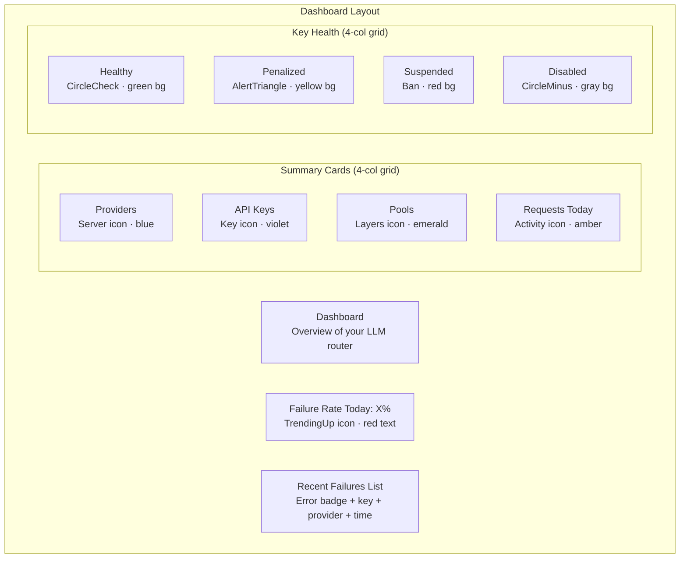
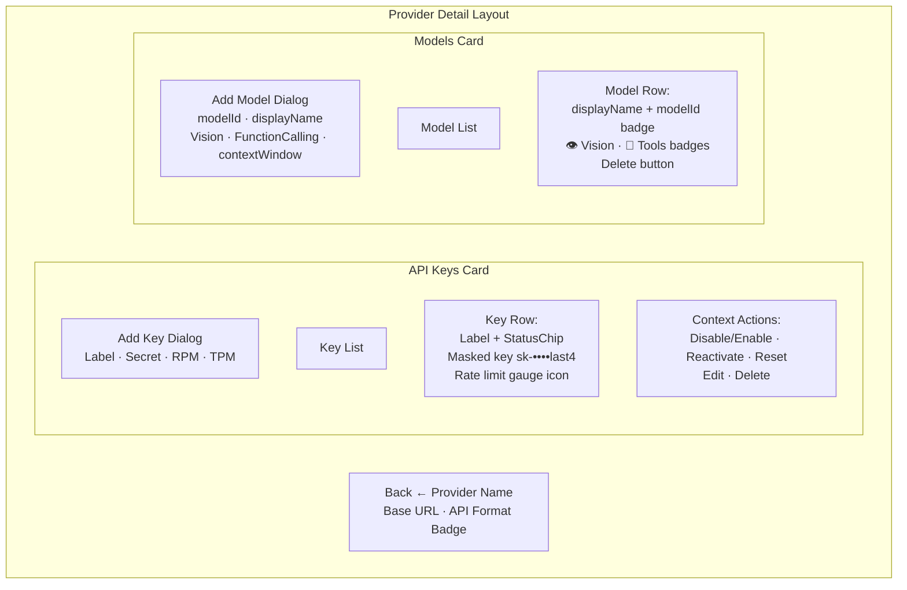
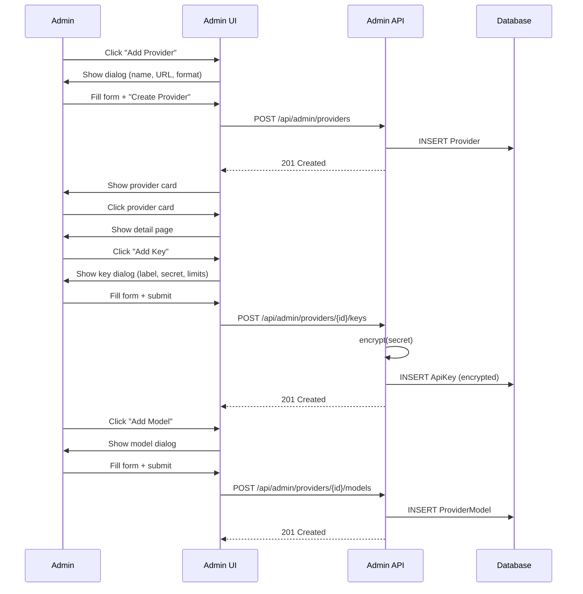
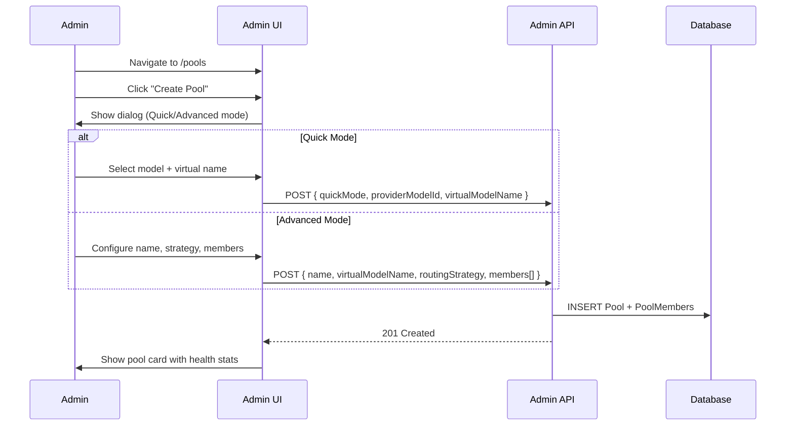
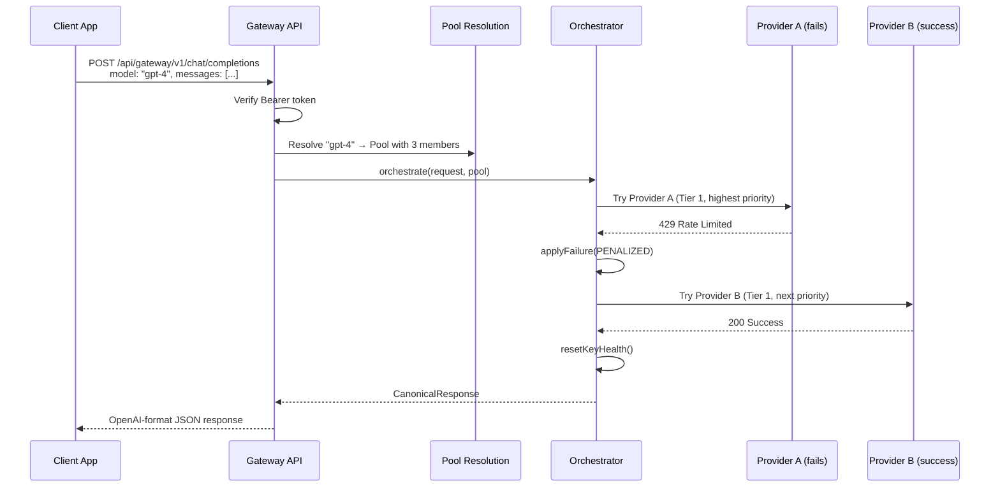

# Document 05 — Admin Dashboard & User Interface

> **Purpose**: Complete reference for the admin UI pages, components, design system, and user interactions.  
> **Last Updated**: 2026-08-18

---

## 1. UI Architecture Overview

```mermaid
graph TB
    subgraph "Layout Shell"
        ROOT[Root Layout<br/>HTML + globals.css]
        ADMIN[Admin Layout<br/>Sidebar + Content]
    end

    subgraph "Pages"
        DASH[Dashboard<br/>/dashboard]
        PROV[Providers List<br/>/providers]
        PROV_DET[Provider Detail<br/>/providers/[id]]
        POOL[Pools List<br/>/pools]
        POOL_DET[Pool Detail<br/>/pools/[id]]
        LOGS[Logs Viewer<br/>/logs]
        USAGE[Usage Analytics<br/>/usage]
        SETTINGS[Settings<br/>/settings]
    end

    subgraph "Reusable Components"
        SIDEBAR[layout/sidebar.tsx]
        UI[ui/* — 9 primitives]
        USAGE_COMP[usage/* — 5 sub-components]
    end

    ROOT --> ADMIN
    ADMIN --> SIDEBAR
    ADMIN --> DASH
    ADMIN --> PROV
    ADMIN --> PROV_DET
    ADMIN --> POOL
    ADMIN --> POOL_DET
    ADMIN --> LOGS
    ADMIN --> USAGE
    ADMIN --> SETTINGS

    DASH --> UI
    PROV --> UI
    PROV_DET --> UI
    POOL --> UI
    POOL_DET --> UI
    LOGS --> UI
    USAGE --> UI
    USAGE --> USAGE_COMP
    SETTINGS --> UI
```

### Routing Structure

The `(admin)` route group provides a shared sidebar layout without affecting URLs:

| URL Path | File | Purpose |
|---|---|---|
| `/` | `app/page.tsx` | Redirects to `/dashboard` |
| `/dashboard` | `app/(admin)/dashboard/page.tsx` | System overview |
| `/providers` | `app/(admin)/providers/page.tsx` | Provider list |
| `/providers/[id]` | `app/(admin)/providers/[id]/page.tsx` | Provider detail |
| `/pools` | `app/(admin)/pools/page.tsx` | Pool list |
| `/pools/[id]` | `app/(admin)/pools/[id]/page.tsx` | Pool detail |
| `/logs` | `app/(admin)/logs/page.tsx` | Request logs |
| `/usage` | `app/(admin)/usage/page.tsx` | Usage analytics |
| `/settings` | `app/(admin)/settings/page.tsx` | Configuration |

---

## 2. Design System

### Technology Stack

| Layer | Technology |
|---|---|
| CSS Framework | Tailwind CSS v4 |
| Component Pattern | shadcn/ui (Radix UI + CVA + Tailwind) |
| Utility | `cn()` — clsx + tailwind-merge |
| Icons | Lucide React |
| Dark Mode | Automatic via `prefers-color-scheme` |

### Color Tokens (HSL)

| Token | Light | Dark | Usage |
|---|---|---|---|
| `--color-primary` | `hsl(221, 83%, 53%)` blue | `hsl(217, 91%, 60%)` blue | Buttons, links, active states |
| `--color-destructive` | `hsl(0, 84%, 60%)` red | `hsl(0, 63%, 31%)` dark red | Errors, delete actions |
| `--color-success` | `hsl(142, 76%, 36%)` green | `hsl(142, 71%, 45%)` green | Healthy, active states |
| `--color-warning` | `hsl(38, 92%, 50%)` amber | `hsl(48, 96%, 53%)` amber | Penalized, caution |

### UI Primitives (`components/ui/`)

| Component | File | Description | Variants |
|---|---|---|---|
| **Badge** | `badge.tsx` | Inline label/tag | `default`, `secondary`, `destructive`, `outline`, `success`, `warning` |
| **Button** | `button.tsx` | Clickable button | Variant: `default`, `destructive`, `outline`, `secondary`, `ghost`, `link`. Size: `default`, `sm`, `lg`, `icon` |
| **Card** | `card.tsx` | Container card | Composed: `Card`, `CardHeader`, `CardTitle`, `CardDescription`, `CardContent`, `CardFooter` |
| **Dialog** | `dialog.tsx` | Modal dialog | Composed: `Dialog`, `DialogTrigger`, `DialogClose`, `DialogContent`, `DialogHeader`, `DialogFooter`, `DialogTitle`, `DialogDescription` |
| **Input** | `input.tsx` | Text input | Single variant with file input support |
| **Label** | `label.tsx` | Form label | Single variant, peer-disabled support |
| **Select** | `select.tsx` | Dropdown select | Composed: `Select`, `SelectGroup`, `SelectValue`, `SelectTrigger`, `SelectContent`, `SelectItem` |
| **Table** | `table.tsx` | Data table | Composed: `Table`, `TableHeader`, `TableBody`, `TableRow`, `TableHead`, `TableCell` |
| **Textarea** | `textarea.tsx` | Multi-line input | Single variant, min-height 60px |

---

## 3. Sidebar Navigation

**File**: `components/layout/sidebar.tsx`

| Element | Details |
|---|---|
| Width | Fixed 64px (`w-64`) |
| Header | ⚡ Zap icon + "LLM Router" in `h-14` bar |
| Active state | `bg-primary/10 text-primary font-medium` |
| Inactive state | `text-muted-foreground hover:bg-accent` |

**Navigation items**:

| Route | Icon | Label |
|---|---|---|
| `/dashboard` | `LayoutDashboard` | Dashboard |
| `/chat` | `MessageSquare` | Chat |
| `/providers` | `Server` | Providers |
| `/models` | `Boxes` | Models |
| `/pools` | `Layers` | Pools |
| `/benchmarks` | `Gauge` | Benchmarks |
| `/discovery` | `Compass` | Discovery |
| `/terminal` | `Terminal` | Terminal |
| `/playground` | `FlaskConical` | Playground |
| `/usage` | `BarChart3` | Usage |
| `/logs` | `ScrollText` | Logs |
| `/settings` | `Settings` | Settings |

---

## 3.5 Chat Page

**File**: `app/(admin)/chat/page.tsx` → `components/chat/chat-page.tsx`

A direct-chat interface against any **configured model** (from the Models page).

### Data Source
- `GET /api/admin/models` — lists all configured `ProviderModel`s (with provider) for the model selector.
- `POST /api/admin/chat/completions` — streams/non-streams a completion for a selected `providerModelId`.

### Sub-components (`components/chat/`)
| Component | Purpose |
|---|---|
| `chat-model-selector.tsx` | Dropdown of `displayName — provider.name` |
| `chat-message-list.tsx` | Scrollable bubble list, auto-scrolls to newest |
| `chat-message-bubble.tsx` | User / assistant / error bubble; blinking caret + spinner while streaming |
| `chat-input.tsx` | Auto-growing textarea, Enter sends / Shift+Enter newline, Stop button |
| `chat-types.ts` | `ChatModel`, `ChatMessage` types |

### Behavior
- Select a model → type → send → streaming SSE parsed client-side (`data:` chunks, `delta.content`).
- **Stop** aborts via `AbortController`.
- Usage is recorded: the backend runs the request through the same `orchestrate()` engine as the gateway, writing `RequestLog` rows, so chat activity shows up on `/usage`.

### Backend
`POST /api/admin/chat/completions` (`app/api/admin/chat/completions/route.ts`) resolves the `ProviderModel` + provider + its active keys, builds a one-member `ResolvedPool` with `logPoolId: null`, and calls `orchestrate()`. See §8 in `02-engine-architecture.md` for the `logPoolId` override.

---

## 4. Dashboard Page

**File**: `app/(admin)/dashboard/page.tsx`

### Data Source
`GET /api/admin/logs?stats=true` — single fetch on mount (no polling)

### UI Sections



### User Interactions
- None — fully read-only dashboard
- No auto-refresh (single fetch on mount)

---

## 5. Providers Management

### 5.1 Providers List Page

**File**: `app/(admin)/providers/page.tsx`

#### Data Source
`GET /api/admin/providers` — fetches provider list with key/model counts

#### UI Elements

| Section | Elements |
|---|---|
| Header | Title + "Add Provider" button → Dialog |
| Create Dialog | Name, Base URL, API Format (3 options), Notes, "Create Provider" button |
| Provider Cards | 2-column grid: icon + name + badges (format, key count, model count) + arrow |
| Empty State | Server icon + "No providers configured yet." |

#### API Format Options in Dialog

| Value | Display Label |
|---|---|
| `CHAT_COMPLETIONS` | Chat Completions (OpenAI-compatible) |
| `MESSAGES` | Messages (Anthropic-style) |
| `RESPONSES` | Responses (New OpenAI) |

#### User Interactions
- Create provider via dialog
- Click card → navigate to `/providers/{id}`

### 5.2 Provider Detail Page

**File**: `app/(admin)/providers/[id]/page.tsx`

#### Data Source
`GET /api/admin/providers/{id}` — polls every 5 seconds

#### StatusChip Sub-component

Renders key status as a colored badge:

| Status | Badge Variant | Icon | Extra Info |
|---|---|---|---|
| `ACTIVE` | success | `CircleCheck` | — |
| `PENALIZED` | warning | `AlertTriangle` | Level + countdown timer (mm:ss) |
| `SUSPENDED` | destructive | `Ban` | Suspension reason |
| `DISABLED` | outline | `CircleMinus` | — |

#### UI Sections



#### Key Actions by Status

| Current Status | Available Actions |
|---|---|
| ACTIVE | Disable, Edit, Delete |
| PENALIZED | Reset, Edit, Delete |
| SUSPENDED | Reactivate, Reset, Edit, Delete |
| DISABLED | Enable, Edit, Delete |

#### API Calls

| Action | Method | Endpoint |
|---|---|---|
| Add key | POST | `/api/admin/providers/{id}/keys` |
| Edit key | PUT | `/api/admin/keys/{keyId}` |
| Key actions | PATCH | `/api/admin/keys/{keyId}` (body: `{action}`) |
| Delete key | DELETE | `/api/admin/keys/{keyId}` |
| Add model | POST | `/api/admin/providers/{id}/models` |
| Delete model | DELETE | `/api/admin/models/{modelId}` |

---

## 6. Pools Management

### 6.1 Pools List Page

**File**: `app/(admin)/pools/page.tsx`

#### Data Source
`GET /api/admin/pools` — polls every 10 seconds

#### Create Dialog — Two Modes

**Quick Mode** (default):
- Single provider model dropdown
- Virtual model name input
- "Create Quick Pool" button

**Advanced Mode**:
- Pool Name, Virtual Model Name, Description
- Routing Strategy: Round Robin or Priority
- Dynamic member list with cascading provider → model selects
- Priority mode: arrow buttons to reorder
- Add/Remove member buttons

#### Pool Card Content

| Element | Description |
|---|---|
| Name | Pool display name |
| Virtual Model | Code-style badge showing virtual model name |
| Routing Strategy | Badge (ROUND_ROBIN or PRIORITY) |
| Member Count | Number badge |
| Health | `healthyKeys / totalKeys` with color coding |

### 6.2 Pool Detail Page

**File**: `app/(admin)/pools/[id]/page.tsx`

#### Data Source
`GET /api/admin/pools/{id}` — polls every 5 seconds

#### KeyStatusIcon Sub-component

Inline icon-only version of StatusChip:
- ACTIVE → green `CircleCheck`
- PENALIZED → yellow `AlertTriangle` + level + expiry
- SUSPENDED → red `Ban`
- DISABLED → gray `CircleMinus`

#### UI Sections

1. **Header**: Back arrow + pool name + virtual model badge + routing strategy badge
2. **Edit Dialog**: Pre-populated form (same as Advanced Create)
3. **Delete Button**: Confirmation → redirect to `/pools`
4. **Health Summary**: 4-column grid (Healthy/Penalized/Suspended/Disabled counts)
5. **Members & Keys**: Card per member showing provider → model + key list with status icons

---

## 7. Logs Viewer

**File**: `app/(admin)/logs/page.tsx`

### Data Source
`GET /api/admin/logs?page=X&pageSize=50&outcome=X&errorClassification=X` — manual refresh only

### Table Columns

| Column | Content |
|---|---|
| Expand | ChevronDown toggle |
| Time | `toLocaleString()` |
| Model | Monospace `requestedVirtualModel` |
| Key/Provider | `key.label @ provider.name` |
| Pool | Pool name or "Direct" |
| Outcome | Success badge or Destructive badge + classification |
| Latency | `Xms` |
| Tier | Badge if present |

### Expanded Row Details

4-column grid showing:
- HTTP Status, Pool, Model, API Key
- Prompt Tokens, Completion Tokens, Error, Tier

### Filter Options

| Filter | Options |
|---|---|
| Outcome | All / Success / Failure |
| Error Classification | All / Rate Limited / Quota Exceeded / Server Error / Network Error / Auth Error / Invalid Request |

### User Interactions
- Filter by outcome and error classification
- Expand/collapse individual rows
- Navigate pages (Previous/Next)
- Manual refresh button

---

## 8. Usage Analytics

**File**: `app/(admin)/usage/page.tsx`

### Data Sources
- **Stats**: `GET /api/admin/usage?dateFrom=X&dateTo=X&providerId=X&poolId=X&apiKeyId=X` — polls every 5s
- **Rate Limits**: `GET /api/admin/rate-limits/status` — polled by RateLimitCharts sub-component

### Sub-components

#### DateRangeSelector (`usage/date-range-selector.tsx`)

9 presets:
- Past Hour, Past 3 Hours, Today, Yesterday, This Week, This Month, Previous Month, All Time, Custom Range

Custom mode shows two native `<input type="date">` fields.

#### UsageFilterBar (`usage/filter-bar.tsx`)

Cascading filter selects:
- Provider → Pool → API Key
- Selecting a provider fetches that provider's keys
- Emits `{ providerId?, poolId?, apiKeyId? }` via callback

#### UsageStatCards (`usage/stat-cards.tsx`)

6 stat cards with `<RollingNumber>` animations:

| Card | Icon | Color |
|---|---|---|
| Total Tokens | `Coins` | Violet |
| Prompt Tokens | `ArrowUpRight` | Blue |
| Completion Tokens | `ArrowDownRight` | Emerald |
| Total Requests | `Hash` | Amber |
| Successful | `CheckCircle2` | Green |
| Failed | `XCircle` | Red |

#### RollingNumber (`usage/rolling-number.tsx`)

Animated number transitions:
- Uses `requestAnimationFrame` for smooth animation
- Ease-out cubic easing, 600ms duration
- Locale-aware comma formatting

#### RateLimitCharts (`usage/rate-limit-charts.tsx`)

Real-time rate limit visualization:
- Polls `/api/admin/rate-limits/status` every 1 second
- Maintains time-series (up to 60 data points = 1 minute)
- Two SVG line charts: RPM and TPM
- Dashed threshold lines for configured limits
- 10-color palette cycling for multi-key display
- QueueIndicator: amber alert when requests are waiting

---

## 9. Settings Page

**File**: `app/(admin)/settings/page.tsx`

### Data Source
`GET /api/admin/settings` — single fetch on mount

### UI Sections

#### Unified Gateway Key Card
- Gateway endpoint: `http://localhost:4006/api/gateway/v1`
- Shows masked key prefix
- **Regenerate Button**: Confirmation → PUT `{ action: "regenerate-key" }` → displays new plaintext key in red warning box
- Key has show/hide toggle + copy-to-clipboard

#### Penalty Engine Card

| Setting | Default | Description |
|---|---|---|
| Base Cooldown (seconds) | 600 | First-offense penalty duration |
| Multiplier | 3 | Escalation factor per repeat |
| Max Cooldown (seconds) | 21600 | Upper cap (6 hours) |
| Reset Window (seconds) | 3600 | Sustained health before reset |

"Save Settings" button → PUT to `/api/admin/settings`

#### Server Info Card (read-only)
- Gateway endpoint URL
- VS Code Copilot configuration hint

---

## 10. Common UI Patterns

### Data Fetching Pattern

All pages use the same pattern:

```typescript
const [data, setData] = useState<T | null>(null);
const [loading, setLoading] = useState(true);

useEffect(() => {
  fetch(url)
    .then(r => r.json())
    .then(setData)
    .finally(() => setLoading(false));
}, []);
```

- No SWR, React Query, or caching library
- Loading state: "Loading..." text (no skeletons)
- Error state: "Failed to load" text

### Polling Pattern

| Page | Interval | Purpose |
|---|---|---|
| Provider Detail | 5s | Key status updates (penalty countdowns) |
| Pool Detail | 5s | Key health monitoring |
| Pools List | 10s | Health counts |
| Usage | 5s | Token counters |
| Rate Limit Charts | 1s | Real-time RPM/TPM |
| Dashboard | None | Single fetch |
| Logs | None | Manual refresh |

### Component Pattern

All UI components:
- Use `"use client"` directive (Client Components)
- Use `React.forwardRef` for ref forwarding
- Accept `className` merged via `cn(variantStyles, className)`
- Use CVA for variant-based styling
- Use Radix UI for accessible interactive primitives

### Empty Component Directories

These directories exist but are empty (logic is inline in page files):
- `components/dashboard/`
- `components/logs/`
- `components/pools/`
- `components/providers/`
- `components/settings/`

Only `components/usage/` has extracted sub-components (5 files).

---

## 11. Key User Workflows

### Adding a New Provider



### Creating a Pool



### Request Flow (User Perspective)


